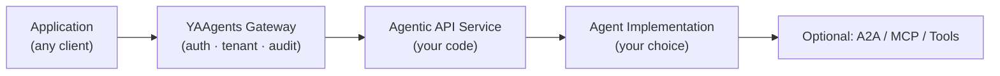

# YAAgents

[](LICENSE)
[](https://golang.org/)
[](https://python.org/)
[](https://github.com/ai-mpathyminds/yaagents/actions)
[](https://ghcr.io/ai-mpathyminds/yaagents-gateway)
[](spec/)

*You're building an AI agent that needs to live behind a normal REST API — with auth, tenancy, audit, typed responses, and OpenAPI. YAAgents is the gateway + SDKs that let you keep your agent framework and still ship a governed product API.*

> **v0.4 work in progress.** Plugins (`token-validator`, `tenant-injector`, `license-check`, `prompt-sanitize`, `otel-audit`) are now Stable. Published artifacts are v0.3.0; v0.4.0 ships in PI5-yaa alongside the Helm chart and full publish wave.

---

## What problem does yaagents solve?

Most production systems already have REST APIs, OpenAPI contracts, gateways, RBAC, audit logs,
tenant context, rate limits, and SDKs.

AI agents often bypass that discipline through chat interfaces, generic invoke endpoints, or
framework-specific runtimes.

yaagents keeps the agent implementation flexible, but exposes it through normal business APIs:

- resource-oriented endpoints
- typed outcomes
- clarification and approval responses
- gateway-level auth, tenant context, audit, and policy
- framework-neutral agent implementation

> See also: [Why Agentic REST?](https://ai-mpathyminds.github.io/yaagents/concepts/why-agentic-rest/) and [Comparisons](https://ai-mpathyminds.github.io/yaagents/concepts/comparisons/) on the docs site.

---

## What you can build

Here's a product-recommendation API that asks for clarification when it has nothing to recommend.

| Endpoint | Agentic response type |
|---|---|
| `POST /recommendations/{customerId}` | `clarification_required` — no purchase history to anchor on |
| `POST /campaigns/{id}/optimizations` | `success` — typed optimization result |
| `POST /claims/{id}/reviews` | `approval_required` — high-risk claim needs human sign-off |

```http
HTTP/1.1 400 Bad Request
Content-Type: application/vnd.yaagents.clarification+json

{
  "type": "clarification_required",
  "requiredInputs": [
    {
      "name": "purchase_history",
      "question": "No purchase history for this customer. What items should anchor recommendations?"
    }
  ],
  "trace": { "correlationId": "corr-1", "requestId": "req-1" }
}
```

Run it: [`examples/store/`](examples/store/) (Python) · [`examples/store-go/`](examples/store-go/) (Go)

---

## How it works



**E-commerce recommendations — 7 steps:**

1. A product catalog service receives `POST /recommendations/{customerId}` requests.
2. The yaagents gateway authenticates the request (token-validator plugin).
3. The gateway injects tenant context (tenant-injector plugin).
4. The backend Python service (using sdk-fastapi) runs recommendation logic.
5. If the recommendation engine needs clarification (e.g., no purchase history), it returns `clarification_required`.
6. The Go client (using sdk-go) handles `clarification_required` natively — no raw HTTP parsing.
7. The audit log (otel-audit plugin) records the operation for every request.

**Response Profile — YAAgents follows the [Agentic REST Response Profile v0.3](spec/).**

| Response type | HTTP status | Content-Type |
|---|---:|---|
| `success` | `200` | `application/json` |
| `created` | `201` | `application/json` |
| `accepted` | `202` | `application/vnd.yaagents.operation+json` |
| `clarification_required` | `400` | `application/vnd.yaagents.clarification+json` |
| `validation_failed` | `422` | `application/vnd.yaagents.validation-error+json` |
| `approval_required` | `412` | `application/vnd.yaagents.approval-required+json` |
| `forbidden` | `403` | `application/vnd.yaagents.error+json` |
| `conflict` | `409` | `application/vnd.yaagents.conflict+json` |
| `failed_dependency` | `424` | `application/vnd.yaagents.error+json` |
| `error` | `500` | `application/vnd.yaagents.error+json` |

See the [full normative spec](spec/agentic-rest-profile.md) for the mandatory `trace` block contract and per-type body shapes.

---

## Who uses it

| You are | Why YAAgents | Start here |
|---|---|---|
| A SaaS product team adding AI features | Keep your existing API surface; add agentic operations as new resource endpoints. | [`examples/store/`](examples/store/) |
| A platform team governing many agent services | One gateway for auth, tenancy, audit, and license — your agent services stay simple. | [Plugin docs](https://ai-mpathyminds.github.io/yaagents/plugins/) |
| An API architect designing an agent product | Typed outcomes, OpenAPI-first contracts, generated clients. No free-form text parsing. | [`spec/agentic-rest-profile.md`](spec/agentic-rest-profile.md) |

> See also: [YAAgents vs A2A, AGNTCY, MCP, and frameworks](https://ai-mpathyminds.github.io/yaagents/concepts/comparisons/) — what each layer is for and where yaagents fits.

---

## Get started

```bash
# Python SDK + client + CLI
pip install yaagents-fastapi yaagents-client yaagents-cli

# TypeScript / Node client
npm install @aimpathyminds/yaagents-client

# Go server SDK
go get github.com/ai-mpathyminds/yaagents-sdk-go

# Go client SDK
go get github.com/ai-mpathyminds/yaagents-client-go

# Gateway container image
docker pull ghcr.io/ai-mpathyminds/yaagents-gateway:0.3.0
```

- [Read the docs](https://ai-mpathyminds.github.io/yaagents/) — full documentation site
- [Profile v0.3](spec/agentic-rest-profile.md) — normative response contract
- [Open issues / contribute](https://github.com/ai-mpathyminds/yaagents/issues)

---

## Repository layout

```
yaagents/
├── spec/                    ← Agentic REST Response Profile (normative)
├── schemas/                 ← JSON schemas for all response types
├── openapi/                 ← Reusable OpenAPI components
├── docs/                    ← Pages site source (Astro Starlight)
├── gateway/                 ← Go gateway source                     [submodule]
├── sdk-fastapi/             ← Python FastAPI server SDK (yaagents-fastapi) [submodule]
├── sdk-go/                  ← Go server SDK (yaagents-sdk-go)       [submodule]
├── client-python/           ← Python client (yaagents-client)       [submodule]
├── client-ts/               ← TypeScript client (@aimpathyminds/yaagents-client) [submodule]
├── client-go/               ← Go client SDK (yaagents-client-go)    [submodule]
├── cli/                     ← CLI validator (yaagents-cli)           [submodule]
└── examples/                ← Reference examples + Docker Compose demos
```

---

## Contributing

See [CONTRIBUTING.md](CONTRIBUTING.md).

---

## License

Apache 2.0 — see [`LICENSE`](LICENSE). Published artifacts are v0.3.0; Profile v0.3. v0.1.x packages shipped under the YAAgents Community License remain under that license (non-retroactive). Contact bhaskar@aimpathyminds.com for historical v0.1.x license questions.

---

## Security

See [SECURITY.md](SECURITY.md) for our responsible-disclosure policy.

---

## Code of Conduct

This project follows the [Contributor Covenant Code of Conduct](CODE_OF_CONDUCT.md).
