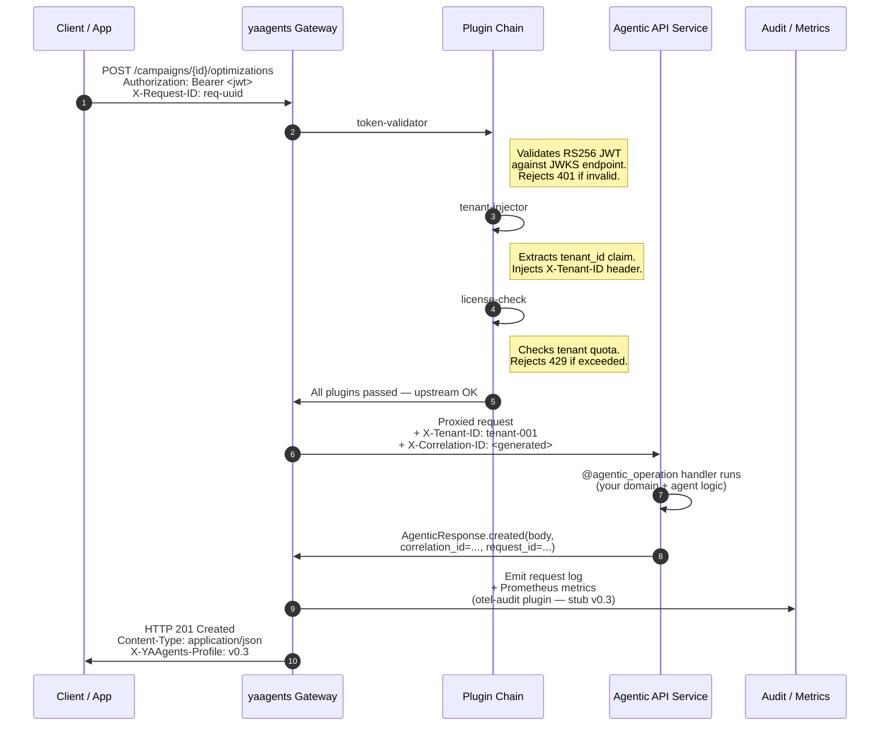

import { Badge } from '@astrojs/starlight/components';

# Gateway Request Lifecycle <Badge text="Stable" variant="success" />

Every request to a yaagents-governed endpoint flows through the same eight steps.
Understanding this lifecycle tells you exactly which layer handles which concern —
and confirms that your agentic service code handles **only domain logic**.

---

## Sequence diagram

---

## Per-step commentary

### Step 1 — Client sends request

The client sends a standard HTTP request. The only yaagents-specific requirement:

- `Authorization: Bearer <jwt>` — RS256 signed token (HS256 accepted in dev mode)
- `X-Request-ID` — optional; client-generated UUID for correlation

The URL is a **resource URL** (`/campaigns/{id}/optimizations`), not a generic
`/agents/invoke`. This is the profile's core discipline.

### Steps 2–4 — Plugin chain

Three active plugins run in order for every v0.3 request:

1. **`token-validator`** — fetches JWKS from the configured issuer, validates RS256
   signature and expiry. Returns `401 Unauthorized` with a `application/vnd.yaagents.error+json`
   body if invalid. Your service code never runs.

2. **`tenant-injector`** — extracts the `tenant_id` claim from the validated JWT.
   Injects `X-Tenant-ID: <value>` into the upstream request headers. Your service
   reads `context.tenant_id` via the SDK — never parses the raw JWT.

3. **`license-check`** — queries the tenant license table. Returns `429 Too Many Requests`
   if the tenant's quota is exhausted. Your service never runs.

Two additional plugins (`prompt-sanitize`, `otel-audit`) are in the pipeline as stubs
in v0.3 — they pass every request through unchanged; their reference implementations
ship in v0.4.

### Step 5 — Gateway proxies upstream

After all plugins pass, the gateway forwards the request to the upstream service URL
configured in `gateway.yaml`. It adds:

- `X-Tenant-ID: <tenant_id>` (from tenant-injector)
- `X-Correlation-ID: <generated>` — a fresh UUID per request for audit correlation

### Steps 6–7 — Agentic service handles request

Your service code runs. The `@agentic_operation` decorator (Python) or `AgenticHandler`
interface (Go) receives an `AgenticContext` with:

- `tenant_id` — from the injected header
- `actor_id` — extracted from the JWT `sub` claim
- `correlation_id` / `request_id` — for the response trace block

Your handler runs domain logic and returns one of the 10 typed `AgenticResponse` factory
calls. The framework never returns bare dicts or arbitrary JSON.

### Step 8 — Audit emission

The gateway's `otel-audit` plugin stub records the request metadata (tenant, route,
outcome type, latency). In v0.3, this is a no-op stub. In v0.4, it emits OTEL spans
to your configured collector.

The gateway also increments Prometheus counters at `/metrics` for every request,
regardless of the otel-audit state.

### Step 9 (implicit) — Response flows back

The typed response from your service flows back through the gateway unchanged. The gateway:

- Adds `X-YAAgents-Profile: v0.3` to the response headers
- Does **not** modify the response body

The client receives a typed HTTP response with a vendor `Content-Type` it can dispatch on.

---

## What happens on plugin rejection

If any plugin rejects the request, the chain short-circuits:

- The gateway returns the plugin's rejection response directly to the client
- **The agentic service never receives the request**
- The rejection response is also a typed `application/vnd.yaagents.error+json` body

This means your service code only runs on authenticated, authorized, licensed requests.

---

[Read next → Plugin Pipeline →](/yaagents/architecture/plugin-pipeline/)
