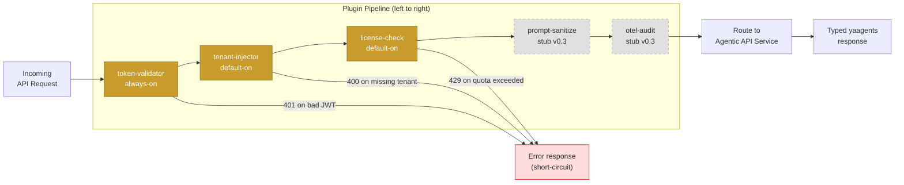

import { Badge } from '@astrojs/starlight/components';

# Plugin Pipeline <Badge text="Stable" variant="success" />

The yaagents gateway plugin pipeline is the single enforcement point for every
cross-cutting concern in a production agentic deployment. This page explains how
the pipeline is composed, how plugins communicate via context, and how to extend it.

---

## Pipeline flow



*Solid nodes are live in v0.3; dashed nodes are stubs awaiting v0.4 reference implementations.*

---

## The plugin interface

Every plugin implements a single Go interface:

```go
// Plugin is the single interface every yaagents gateway plugin must satisfy.
// Init is called once at gateway startup.
// Handler is called once per request, in pipeline order.
// Shutdown is called on gateway drain.
type Plugin interface {
    Init(cfg map[string]any) error
    Handler(ctx context.Context, req *http.Request, next http.Handler) http.ResponseWriter
    Shutdown(ctx context.Context) error
}
```

Key invariants:

- `Handler` MUST call `next.ServeHTTP` to continue the chain, or return its own response
  to short-circuit
- `Handler` MUST NOT store mutable state — each invocation is concurrent
- Context values use typed keys (never raw strings) to avoid collision between plugins

---

## Context key convention

Plugins communicate downstream via `context.Context`. The convention for v0.3:

```go
// Keys exported from each plugin package:
type tenantIDKey struct{}
type actorIDKey  struct{}
type licenseKey  struct{}
type correlationIDKey struct{}

// tenant-injector sets:
ctx = context.WithValue(ctx, tenantIDKey{}, tenantID)

// Your agentic service reads via the SDK helper:
// agenticCtx.TenantID  ← extracted from X-Tenant-ID header by sdk-go
```

The server SDKs (`sdk-fastapi`, `sdk-go`) surface these as typed fields on `AgenticContext`
so your service code never reads raw headers or context values directly.

---

## First-party plugins (v0.3)

### `token-validator` <Badge text="Stable" variant="success" />

Fetches the JWKS from the issuer URL configured in `gateway.yaml`. Validates:

- RS256 signature (HS256 accepted in `dev_mode: true`)
- `exp` claim — rejects expired tokens with 401
- `aud` claim — optional; configurable allowlist

Short-circuits with `401 Unauthorized` + `application/vnd.yaagents.error+json` on any failure.

### `tenant-injector` <Badge text="Stable" variant="success" />

Extracts the `tenant_id` claim from the validated JWT. Injects:

- `X-Tenant-ID: <value>` into the upstream request headers
- `X-Actor-ID: <sub>` — the JWT `sub` claim

Short-circuits with `400 Bad Request` if `tenant_id` claim is absent and
`require_tenant: true` (default).

### `license-check` <Badge text="Stable" variant="success" />

Queries the tenant license table (in-memory cache, refreshed every 60s). Returns:

- `429 Too Many Requests` + `Retry-After` header if quota is exhausted
- Passes through if quota is available; decrements the counter

### `prompt-sanitize` <Badge text="Preview" variant="caution" />

Stub in v0.3. The interface is stable and the plugin is in the pipeline (it always calls
`next`). v0.4 ships the reference implementation: pattern-filter rules on request JSON
bodies for known prompt-injection vectors.

### `otel-audit` <Badge text="Preview" variant="caution" />

Stub in v0.3. Always calls `next`. v0.4 ships OTEL span emission to a configurable
OTLP exporter, with per-request attributes: tenant, actor, route, outcome type,
latency, token counts (when available).

---

## Extensibility contract

The plugin pipeline is **open-closed**: you can add custom plugins without modifying the
first-party ones. The gateway config loads plugins by name; any registered plugin
can appear in the pipeline.

```yaml
# gateway.yaml — custom plugin example
plugins:
  - name: token-validator
    config: { issuer: "https://auth.example.com/realms/prod" }
  - name: tenant-injector
  - name: license-check
  - name: my-org/rate-limiter      # ← custom plugin registered at startup
    config: { burst: 50, rate: 10 }
  - name: otel-audit
    config: { endpoint: "http://otel-collector:4317" }
```

Community plugins are indexed at [GitHub Discussions](https://github.com/ai-mpathyminds/yaagents/discussions).
See [Add a community plugin →](/yaagents/how-to/add-community-plugin/) for the wiring guide.

---

[Read next → Typed Outcome Model →](/yaagents/patterns/typed-outcome-model/)
