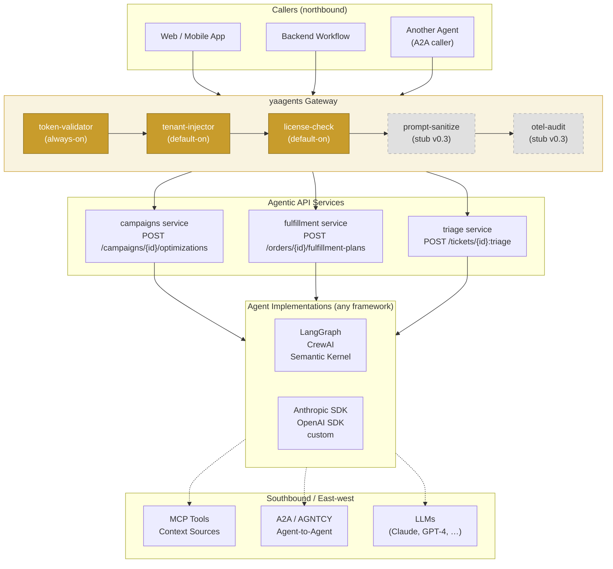
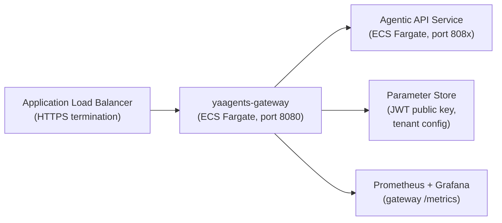

import { Badge } from '@astrojs/starlight/components';

# Reference Architecture <Badge text="Stable" variant="success" />

This page expands the homepage architecture diagram with per-component callouts
and a deployment topology for a production yaagents deployment.

---

## Full architecture diagram

*Dashed plugin nodes are stubs in v0.3 — interface stable, reference implementation ships in v0.4.*

---

## Component callouts

### yaagents Gateway

The gateway is a **single stateless binary** (Docker image:
`ghcr.io/ai-mpathyminds/yaagents-gateway:0.3.0`) that:

- Runs a configurable plugin pipeline on every inbound request
- Proxies the request to the upstream agentic service with injected headers
- Returns the service response verbatim (typed `AgenticResponse` flows through unchanged)
- Adds `X-YAAgents-Profile: v0.3` to every response

The gateway does **not** inspect or modify response bodies. It is not an API gateway in
the full sense — it does not do request routing by URL pattern (use your load balancer for
that), rate limiting (use a dedicated layer), or caching.

### Plugin pipeline

Five first-party plugins ship with v0.3. Plugins implement a single Go interface
(`Handler(ctx, req, next) Response`) and are composed at startup from `gateway.yaml`.

| Plugin | Status | Effect |
|--------|--------|--------|
| `token-validator` | <Badge text="Stable" variant="success" /> | Validates RS256 JWT; rejects 401 if invalid |
| `tenant-injector` | <Badge text="Stable" variant="success" /> | Extracts `tenant_id` claim; injects `X-Tenant-ID` header |
| `license-check` | <Badge text="Stable" variant="success" /> | Checks tenant license quota; rejects 429 if exceeded |
| `prompt-sanitize` | <Badge text="Preview" variant="caution" /> | Pattern-filter stub; always passes in v0.3 |
| `otel-audit` | <Badge text="Preview" variant="caution" /> | Audit-emit stub; always passes in v0.3 |

### Agentic API Service

Your service. Two shapes supported:

- **FastAPI** (Python): use `@agentic_operation` decorator + `AgenticResponse` factory
- **Go HTTP**: use `AgenticHandler` interface + `AgenticResponse` builder

The service returns one of 10 typed outcomes. The gateway does not care about the
framework — any HTTP service returning the correct `Content-Type` and body shape is
conformant with the Profile.

### Agent Implementation

No constraints. The `@agentic_operation` handler body runs your agent logic:

- Call LLMs (Anthropic, OpenAI, Bedrock — any)
- Use MCP tools for context retrieval
- Spawn sub-agents via A2A
- Call internal microservices

The agent implementation is invisible to callers — they only see the typed HTTP response.

---

## Deployment topology

*Reference topology for AWS ECS Fargate. Terraform modules at
`portfolio/infrastructure/modules/ecs-fargate-service/`.*

---

[Read next → Gateway Request Lifecycle →](/yaagents/architecture/gateway-request-lifecycle/)
