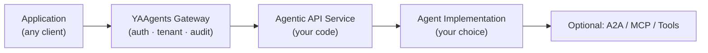

import { LinkCard, CardGrid, Aside } from '@astrojs/starlight/components';

## Context

An e-commerce SaaS needs a product-recommendation endpoint that behaves correctly in three
situations: when a customer has rich purchase history, when they are brand new with no history
yet, and when the request comes from a different store tenant (e.g., a white-label partner).
The team chose YAAgents because the `clarification_required` response type expresses the
"no history" case as a first-class outcome — not as a special error — and the gateway plugin
pipeline handles per-store authentication and audit without any code changes to the
recommendation service itself.

## The full flow

<Aside type="note">
  This section is a copy of the
  [YAAgents README → §How it works](https://github.com/ai-mpathyminds/yaagents#how-it-works)
  for convenience. The README is the canonical source; if the two diverge, README is correct.
</Aside>



**E-commerce recommendations — 7 steps:**

1. A product catalog service receives `POST /recommendations/{customerId}` requests.
2. The yaagents gateway authenticates the request (`token-validator` plugin).
3. The gateway injects tenant context (`tenant-injector` plugin).
4. The backend Python service (using `sdk-fastapi`) runs recommendation logic.
5. If the recommendation engine needs clarification (e.g., no purchase history), it returns `clarification_required`.
6. The Go client (using `sdk-go`) handles `clarification_required` natively — no raw HTTP parsing.
7. The audit log (`otel-audit` plugin) records the operation for every request.

**Response Profile — YAAgents follows the [Agentic REST Response Profile v0.3](/yaagents/profile/).**

| Response type | HTTP status | Content-Type |
|---|---:|---|
| `success` | `200` | `application/json` |
| `created` | `201` | `application/json` |
| `accepted` | `202` | `application/vnd.yaagents.operation+json` |
| `clarification_required` | `400` | `application/vnd.yaagents.clarification+json` |
| `validation_failed` | `422` | `application/vnd.yaagents.validation-error+json` |
| `approval_required` | `412` | `application/vnd.yaagents.approval-required+json` |
| `forbidden` | `403` | `application/vnd.yaagents.error+json` |
| `conflict` | `409` | `application/vnd.yaagents.conflict+json` |
| `failed_dependency` | `424` | `application/vnd.yaagents.error+json` |
| `error` | `500` | `application/vnd.yaagents.error+json` |

## Domain context and design choices

**Why `clarification_required` instead of returning empty results.**
When a new customer visits with zero purchase history, returning an empty recommendations list
would be technically correct but useless. The recommendation engine cannot make a meaningful
prediction without an anchor point. Using `clarification_required` (HTTP 400 +
`application/vnd.yaagents.clarification+json`) the service asks the client for a seed product
or preferred category — the requiredInputs field in the response body drives the UI to display
a one-question dialog rather than an empty state. This is a deliberate agentic conversation,
not a failure.

**Why `tenant-injector` instead of passing tenant context in the request body.**
The SaaS serves multiple white-label retail partners from a single deployed service. Each
partner has its own product catalog and pricing rules. Embedding tenant context in request
bodies would require every SDK caller to read and forward tenant credentials — coupling the
client to the tenancy model. Instead, `tenant-injector` reads `X-Tenant-ID` from the gateway
request and writes `X-Tenant-Context` with the resolved tenant payload before forwarding to
the recommendation service. The service reads one header, no credential management needed.

**Why `otel-audit` at the gateway, not inside the recommendation service.**
Every recommendation request — successful, clarification, or error — creates an audit record
that must survive even if the upstream service crashes mid-request. Placing the audit emitter
at the gateway (via the `otel-audit` plugin) ensures the record is written before the request
reaches the service. The sdk-go `AuditEmitter` inside the recommendation service adds a
finer-grained audit event when the response is written, and both records share the same
`correlation_id` (from `X-Correlation-ID`) so operators can correlate gateway-level and
service-level events in a single trace.

## Runnable examples

The `examples/store/` (Python/sdk-fastapi) and `examples/store-go/` (Go/sdk-go) directories
implement this exact recommendation flow with the full gateway pipeline enabled.

**Python (sdk-fastapi):**

```bash
cd examples/store
docker compose up -d
```

**Go (sdk-go):**

```bash
cd examples/store-go
docker compose up -d
```

Both compose stacks start the YAAgents Gateway on port 8120 and the recommendation service on
port 8121. Once running, send a request with no purchase history to trigger the
`clarification_required` flow:

```bash
curl -sX POST http://localhost:8121/products/p-1/recommendations \
  -H 'Content-Type: application/json' \
  -H 'Authorization: Bearer demo-token' \
  -H 'X-Tenant-ID: tenant-001' \
  -d '{"limit": 3, "exclude_purchased": true}' | jq
```

Expected response (HTTP 400):

```json
{
  "type": "clarification_required",
  "message": "No purchase history found for this customer.",
  "required_inputs": [
    {"name": "seed_product_id", "description": "A product the customer has shown interest in"},
    {"name": "preferred_category", "description": "Top-level category preference (e.g. electronics)"}
  ]
}
```

<Aside type="tip">
  The `examples/store/` readme has a complete `curl` sequence covering all three outcomes:
  `clarification_required`, `success`, and `validation_failed`. Run them in order to see the
  full agentic conversation cycle.
</Aside>

## What to read next

<CardGrid>
  <LinkCard
    title="Quickstart"
    href="/yaagents/quickstart/"
    description="Set up the gateway and run your first agentic endpoint in under 10 minutes."
  />
  <LinkCard
    title="Plugin overview"
    href="/yaagents/plugins/"
    description="token-validator, tenant-injector, license-check, prompt-sanitize, otel-audit — pipeline and config."
  />
  <LinkCard
    title="Profile spec"
    href="/yaagents/profile/"
    description="Normative Agentic REST Response Profile v0.3 — all response types, status codes, and media types."
  />
</CardGrid>
