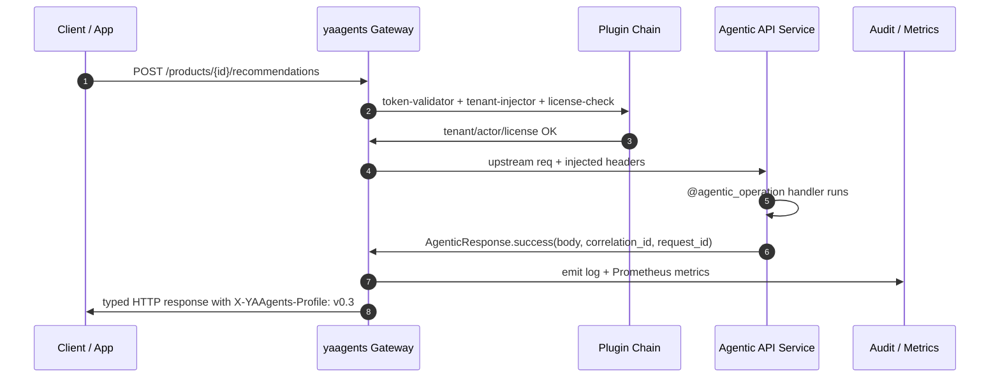

import { Tabs, TabItem } from '@astrojs/starlight/components';

When you add an AI agent to a REST API, how you name and shape that endpoint determines everything downstream: authorization scope, OpenAPI documentation, audit granularity, SDK ergonomics, and client error handling.

This page catalogs four canonical agentic REST patterns — all grounded in yaagents v0.3 shipped capability — plus the one anti-pattern to avoid.

## Request lifecycle

Every agentic endpoint in yaagents flows through the same gateway-enforced lifecycle before your service code runs:



The plugin chain runs before your service sees the request. Your handler only needs to implement the domain logic and return a typed `AgenticResponse`.

---

## Pattern 1 — Create an agent-generated resource

**When to use:** The agent produces a new domain artifact — an optimization, a fulfillment plan, a generated document. The result is *something the system created*, so it belongs under the parent resource.

**Canonical endpoint:** `POST /campaigns/{id}/optimizations` (shipped in `examples/campaign-api`)

**v0.4 example:** `POST /claims/{id}/reviews`

**Expected outcomes:**
| Status | Outcome | When |
|--------|---------|------|
| `201 Created` | Sync result ready | Agent completes within the request |
| `202 Accepted` | Async — poll or webhook | Agent computation is long-running |
| `400` `clarification_required` | Agent needs more input | Request is ambiguous or incomplete |
| `412` `approval_required` | Human approval gate | High-consequence action requires sign-off |

```python title="app.py — Pattern 1 (Python / sdk-fastapi)"
from yaagents_fastapi import (
    AgenticContext, AgenticResponse, AgenticResponses,
    RequiredInput, agentic_operation, agentic_route_kwargs,
)

@agentic_operation(
    resource="Campaign",
    operation_kind="recommendation",
    mutating=False,
    responses=AgenticResponses(
        created=True,
        clarification_required=True,
        validation_failed=True,
    ),
)
async def create_optimization(
    campaign_id: str,
    body: CreateOptimizationRequest,
    ctx: Annotated[AgenticContext, Depends(AgenticContext)],
) -> Response:
    campaign = get_campaign(campaign_id)
    if campaign is None:
        raise HTTPException(status_code=404, detail="Campaign not found.")

    if not body.objectives:
        return AgenticResponse.clarification_required(
            required_inputs=[
                RequiredInput(
                    name="objectives",
                    location="body",
                    type="array",
                    required=True,
                    question="Which objectives should the optimization target?",
                    allowed_values=["ctr", "cpl", "conversion_rate", "roas"],
                ).to_dict()
            ],
            message="At least one objective is required.",
            correlation_id=ctx.correlation_id,
            request_id=ctx.request_id,
        )

    result = run_optimizer(campaign, body.objectives)
    return AgenticResponse.created(
        body={"optimization": result},
        correlation_id=ctx.correlation_id,
        request_id=ctx.request_id,
    )

app.add_api_route(
    "/campaigns/{campaign_id}/optimizations",
    create_optimization,
    methods=["POST"],
    **agentic_route_kwargs(create_optimization),
)
```

**HTTP response shapes:**

```http
# 201 — optimization created
HTTP/1.1 201 Created
Content-Type: application/json
X-YAAgents-Profile: v0.3

{ "optimization": { "id": "opt-42", "objectives": ["ctr"], ... } }
```

```http
# 400 — clarification required
HTTP/1.1 400 Bad Request
Content-Type: application/vnd.yaagents.clarification+json
X-YAAgents-Profile: v0.3

{
  "type": "clarification_required",
  "message": "At least one objective is required.",
  "requiredInputs": [{ "name": "objectives", ... }]
}
```

---

## Pattern 2 — Recommend without applying

**When to use:** The agent analyses a resource and returns candidates, but **nothing changes** until the user explicitly applies one. The endpoint is idempotent from the domain's perspective — it reads, reasons, and responds.

**Canonical endpoint:** `POST /products/{id}/recommendations` (our shipped `examples/store`)

**Aspirational:** `POST /pull-requests/{id}/reviews`

The response body makes it explicit that nothing was mutated — the `reasoning` field and the absence of a `Location` header tell any client (human or agent) that this is advisory.

```python title="app.py — Pattern 2 (Python / sdk-fastapi)"
@agentic_operation(
    resource="ProductRecommendations",
    operation_kind="recommendation",
    mutating=False,
    responses=AgenticResponses(success=True),
)
async def recommend_products(
    product_id: str,
    body: RecommendBody,
    ctx: Annotated[AgenticContext, Depends(AgenticContext)],
) -> Response:
    if get_product(product_id) is None:
        raise HTTPException(status_code=404, detail=f"Product {product_id} not found.")

    recommendations, reasoning = mock_recommend(
        product_id=product_id,
        customer_id=ctx.actor_id,
        limit=body.limit,
    )
    return AgenticResponse.success(
        body={
            "seed_product_id": product_id,
            "recommendations": recommendations,
            "reasoning": reasoning,   # explicit: advisory output, nothing applied
        },
        correlation_id=ctx.correlation_id,
        request_id=ctx.request_id,
    )
```

**HTTP response shape:**

```http
HTTP/1.1 200 OK
Content-Type: application/json
X-YAAgents-Profile: v0.3

{
  "seed_product_id": "prod-42",
  "recommendations": [{ "id": "prod-7", "score": 0.94 }, ...],
  "reasoning": "Same category (electronics), complementary use case."
}
```

:::note[Nothing changed]
`200 OK` (not `201 Created`) + no `Location` header + a `reasoning` field = unambiguous signal to any client or downstream agent that this response is advisory only.
:::

---

## Pattern 3 — Triage or classify

**When to use:** The operation is a command — *do this thing to this resource* — and doesn't produce a new child resource. Use an **action-style suffix** (`:triage`, `:classify`, `:validate`) on the resource path.

**Canonical endpoint:** `POST /tickets/{id}:triage` (built from scratch in the [30-minute tutorial](/yaagents/tutorials/build-an-agentic-rest-api-in-30-min/))

The action suffix signals that this is a verb applied to an existing resource, not a new resource creation. It remains compatible with standard REST tooling — the path is just a string.

```python title="app.py — Pattern 3 (Python / sdk-fastapi)"
@agentic_operation(
    resource="TicketTriage",
    operation_kind="analysis",
    mutating=False,
    responses=AgenticResponses(
        success=True,
        clarification_required=True,
        validation_failed=True,
    ),
)
async def triage_ticket(
    ticket_id: str,
    ctx: Annotated[AgenticContext, Depends(AgenticContext)],
) -> Response:
    ticket = get_ticket(ticket_id)
    if ticket is None:
        return AgenticResponse.validation_failed(
            code="TICKET_NOT_FOUND",
            message=f"Ticket {ticket_id} not found.",
            correlation_id=ctx.correlation_id,
            request_id=ctx.request_id,
        )

    if ticket.get("priority_hint") is None:
        return AgenticResponse.clarification_required(
            required_inputs=[
                RequiredInput(
                    name="priority_hint",
                    location="body",
                    type="string",
                    required=False,
                    question="What is the urgency level? (low / medium / high / critical)",
                ).to_dict()
            ],
            message="Priority hint would improve triage accuracy.",
            correlation_id=ctx.correlation_id,
            request_id=ctx.request_id,
        )

    result = triage(ticket)
    return AgenticResponse.success(
        body={"triage": result},
        correlation_id=ctx.correlation_id,
        request_id=ctx.request_id,
    )

app.add_api_route(
    "/tickets/{ticket_id}:triage",
    triage_ticket,
    methods=["POST"],
    **agentic_route_kwargs(triage_ticket),
)
```

**HTTP response shapes:**

```http
# 200 — triage complete
HTTP/1.1 200 OK
Content-Type: application/json
X-YAAgents-Profile: v0.3

{
  "triage": {
    "category": "security",
    "severity": "high",
    "suggested_team": "security-response",
    "reasoning": "Keywords: 'authentication bypass', 'production'"
  }
}
```

```http
# 400 — clarification needed
HTTP/1.1 400 Bad Request
Content-Type: application/vnd.yaagents.clarification+json

{
  "type": "clarification_required",
  "message": "Priority hint would improve triage accuracy.",
  "requiredInputs": [{ "name": "priority_hint", ... }]
}
```

---

## Pattern 4 — Apply approved changes

**Coming in v0.4.** Separate the recommendation (Pattern 1) from the application when side effects matter — cost, irreversibility, external system calls. The user or approval workflow explicitly calls the `:apply` action after reviewing the recommendation.

**v0.4 endpoint:** `POST /campaigns/{id}/optimizations/{optimizationId}:apply`

```http
# v0.4 — request to apply an approved optimization
POST /campaigns/c-42/optimizations/opt-7:apply
Authorization: Bearer <token>
X-Tenant-ID: tenant-001

{}

# Response: 200 OK — changes applied; or 412 approval_required if not yet approved
```

This pattern intentionally adds a network round-trip. That cost buys you a clean audit record, an explicit approval gate, and the ability to dry-run before committing.

---

## Anti-pattern — Generic invoke

```http
# Don't do this
POST /agents/invoke
{
  "agent": "campaign-optimizer",
  "input": { ... }
}
```

The opaque `/agents/invoke` endpoint fails on every production axis:

| Axis | Problem |
|------|---------|
| **Authorization** | Hard to scope RBAC to a specific resource — any token that can call `/agents/invoke` can call any agent |
| **Audit** | The `resource` field in the audit log is `invoke` for every call — post-hoc analysis is impossible |
| **OpenAPI** | One endpoint with a discriminated union `agent` field; impossible to generate useful client stubs |
| **Versioning** | Changing one agent's interface requires versioning the entire `/invoke` surface |
| **Client error handling** | Clients must parse `response.body.type` to know what happened — no HTTP status semantics |
| **Gateway routing** | You can't route `/agents/invoke` to different upstreams per resource without parsing the body |

Use one of the four patterns above instead. Each produces an endpoint that can be individually authorized, documented, versioned, and audited.

---

## Choosing a pattern

| Situation | Pattern |
|-----------|---------|
| Agent creates a new domain artifact | 1 — Create |
| Agent analyses and advises; nothing changes | 2 — Recommend |
| Agent categorises or labels an existing resource | 3 — Triage/classify |
| Human-in-the-loop approval before side effects | 4 — Apply (v0.4) |
| Any of the above but with `POST /agents/invoke` | Anti-pattern — refactor |

## See also

- [Production Agent API Checklist](/yaagents/explanation/production-agent-api-checklist/) — 25 items to validate before shipping
- [Build an Agentic REST API in 30 Minutes](/yaagents/tutorials/build-an-agentic-rest-api-in-30-min/) — build Pattern 3 from scratch
- [Profile v0.3 spec](/yaagents/reference/profile-v03/) — full typed response contract
- [sdk-fastapi reference](/yaagents/reference/sdk-fastapi/) — `@agentic_operation` decorator API
