:::note[Coming in v0.4]
This page is on the v0.4 roadmap. We'd love your input — start a
conversation on [GitHub Discussions](https://github.com/ai-mpathyminds/yaagents/discussions)
to tell us what you'd find most useful here.
:::

## The v0.3 plugin chain

Even before the full plugin model documentation lands, here is the live pipeline every
request flows through in v0.3:

```mermaid
flowchart LR
    REQ[Incoming<br/>API Request] --> TV[token-validator<br/>always-on]
    TV --> TI[tenant-injector<br/>default-on]
    TI --> LC[license-check<br/>default-on]
    LC --> PS[prompt-sanitize<br/>stub v0.3]
    PS --> OA[otel-audit<br/>stub v0.3]
    OA --> ROUTE[Route to<br/>Agentic API Service]
    ROUTE --> RESP[Typed yaagents<br/>response]

    style TV fill:#c89c2c,stroke:#8b6f1e,color:#fff
    style TI fill:#c89c2c,stroke:#8b6f1e,color:#fff
    style LC fill:#c89c2c,stroke:#8b6f1e,color:#fff
    style PS fill:#e0e0e0,stroke:#888,stroke-dasharray:5
    style OA fill:#e0e0e0,stroke:#888,stroke-dasharray:5
```

*Solid nodes are live in v0.3; dashed nodes are stubs awaiting v0.4 reference implementations.*

## What this page will cover

- Plugin lifecycle (`Init` at startup, `Handler` per request, `Shutdown` on drain)
- Plugin pipeline ordering — default plugin chain for a new gateway deployment
- How plugins share context via the `context.Context` key convention
- Short-circuit semantics — when a plugin returns early (e.g. `token-validator` rejects)
- The "zero required code in agent services" principle — all cross-cutting concerns in plugins

## In the meantime

- [Plugin interface reference →](/yaagents/reference/plugin-interface/) — the Go interface
- [Write a custom JWT validator →](/yaagents/how-to/custom-jwt-validator/) — worked example
- [GitHub Discussions →](https://github.com/ai-mpathyminds/yaagents/discussions) — ask + suggest
