Use this checklist before shipping an AI agent behind a REST API. Every item is tagged with who provides it:

- **✅ v0.3 ships this** — yaagents gateway + SDK handles it for you at v0.3
- **🔜 Coming in v0.4** — on the v0.4 roadmap; not yet enforced by the gateway
- **🔧 Operator-side** — your responsibility in your service implementation

---

## 1. API shape

| # | Item | Status |
|---|------|--------|
| 1.1 | Endpoint is a domain resource operation, not `/agents/invoke` | ✅ v0.3 ships this — [Agentic REST Patterns](/yaagents/explanation/agentic-rest-patterns/) |
| 1.2 | Endpoint is documented in OpenAPI (path, request body, all response shapes) | ✅ v0.3 ships this — `agentic_route_kwargs()` populates OpenAPI metadata automatically |
| 1.3 | Request body is a typed Pydantic / Go struct — not `map[string]any` | ✅ v0.3 ships this — sdk-fastapi and sdk-go enforce typed request bodies |
| 1.4 | Agent-specific outcomes use yaagents media types (`application/vnd.yaagents.clarification+json`, etc.) | ✅ v0.3 ships this — `AgenticResponse.*` constructors set Content-Type automatically |
| 1.5 | At least one example for each outcome: success, clarification_required, validation_failed, approval_required, accepted | ✅ v0.3 ships this — Profile spec §4 table; see [examples](/yaagents/examples/store/) |

**What "typed request body" means in practice:**

```python title="sdk-fastapi — typed body (correct)"
class TriageBody(BaseModel):
    priority_hint: str | None = None

@agentic_operation(resource="TicketTriage", operation_kind="analysis", mutating=False,
                   responses=AgenticResponses(success=True, clarification_required=True))
async def triage_ticket(ticket_id: str, body: TriageBody, ctx: CtxDep) -> Response: ...
```

---

## 2. Governance

| # | Item | Status |
|---|------|--------|
| 2.1 | Authentication enforced before agent runs | ✅ v0.3 ships this — `token-validator` plugin; runs first in every request chain |
| 2.2 | Authorization scoped to the domain resource, not to a generic `/agents` scope | ✅ v0.3 ships this — gateway route config carries per-route `roles: [...]` |
| 2.3 | Tenant context injected by the gateway (not read from the request body) | ✅ v0.3 ships this — `tenant-injector` plugin; injects `X-Tenant-ID` + `X-Actor-Subject` before your service sees the request |
| 2.4 | License / quota checked before expensive agent execution | ✅ v0.3 ships this — `license-check` plugin; returns 402 before upstream call when quota exceeded |
| 2.5 | Prompt content validated / sanitized before forwarding to LLM | 🔜 Coming in v0.4 — `prompt-sanitize` plugin exists as a stub; reference implementation ships in v0.4 |
| 2.6 | Audit events include: resource, tenant, user, operation, result-type, correlation-id | 🔧 Partial v0.3 — gateway log lines include correlation-id + operation + result-type; full OTLP structured audit (`otel-audit` plugin) is a stub; full implementation Coming in v0.4 |

:::caution[prompt-sanitize is a stub in v0.3]
`prompt-sanitize` is registered in the plugin chain and returns a pass-through in v0.3. It does **not** scan or sanitize prompt content yet. If prompt injection is a risk for your service, implement sanitization in your service handler until v0.4 ships.
:::

**Gateway plugin flow (v0.3):**

```mermaid
flowchart LR
    REQ[Incoming<br/>API Request] --> TV[token-validator<br/>always-on]
    TV --> TI[tenant-injector<br/>default-on]
    TI --> LC[license-check<br/>default-on]
    LC --> PS[prompt-sanitize<br/>stub v0.3]
    PS --> OA[otel-audit<br/>stub v0.3]
    OA --> ROUTE[Route to<br/>Agentic API Service]
    ROUTE --> RESP[Typed yaagents<br/>response]

    style TV fill:#c89c2c,stroke:#8b6f1e,color:#fff
    style TI fill:#c89c2c,stroke:#8b6f1e,color:#fff
    style LC fill:#c89c2c,stroke:#8b6f1e,color:#fff
    style PS fill:#e0e0e0,stroke:#888,stroke-dasharray:5
    style OA fill:#e0e0e0,stroke:#888,stroke-dasharray:5
```



*Solid nodes are live in v0.3; dashed nodes are stubs awaiting v0.4 reference implementations.*

---

## 3. Runtime behavior

| # | Item | Status |
|---|------|--------|
| 3.1 | `clarification_required` is machine-readable — includes `requiredInputs` array, not just a message string | ✅ v0.3 ships this — `AgenticResponse.clarification_required(required_inputs=[RequiredInput(...)])` |
| 3.2 | `validation_failed` is distinct from `clarification_required` — different HTTP status + Content-Type | ✅ v0.3 ships this — `422 application/vnd.yaagents.validation_failed+json` vs `400 application/vnd.yaagents.clarification+json` |
| 3.3 | `approval_required` is explicit — includes `approvalId` and the proposed action for the approver | ✅ v0.3 ships this — `AgenticResponse.approval_required(approval_id=..., proposed_action=...)` |
| 3.4 | Long-running operations return `202 Accepted` — not a blocking `200` | ✅ v0.3 ships this — `AgenticResponse.accepted(poll_url=..., estimated_completion=...)` |
| 3.5 | Every response carries correlation/request trace — `X-YAAgents-Profile` header + `correlation_id` + `request_id` in body | ✅ v0.3 ships this — sdk-fastapi sets `X-YAAgents-Profile: v0.3` + propagates `correlation_id` from `AgenticContext` |
| 3.6 | Errors do not leak prompt content, tenant context, or credential details | 🔧 Operator-side — implement in your error handler; never echo LLM prompt, API keys, or internal tenant IDs in 4xx/5xx responses |

**Typed outcomes in sdk-fastapi:**

```python title="All six outcome constructors"
# Success
AgenticResponse.success(body={...}, correlation_id=ctx.correlation_id, request_id=ctx.request_id)

# Agent needs more information
AgenticResponse.clarification_required(required_inputs=[...], message="...",
                                        correlation_id=ctx.correlation_id, request_id=ctx.request_id)

# Client sent invalid data
AgenticResponse.validation_failed(code="FIELD_INVALID", message="...",
                                   correlation_id=ctx.correlation_id, request_id=ctx.request_id)

# Action requires human approval
AgenticResponse.approval_required(approval_id="appr-42", proposed_action={...},
                                   correlation_id=ctx.correlation_id, request_id=ctx.request_id)

# Long-running — poll for result
AgenticResponse.accepted(poll_url="/jobs/job-99", estimated_completion="PT30S",
                          correlation_id=ctx.correlation_id, request_id=ctx.request_id)

# Upstream dependency failure
AgenticResponse.failed_dependency(code="LLM_UNAVAILABLE", message="...",
                                   correlation_id=ctx.correlation_id, request_id=ctx.request_id)
```

---

## 4. Client experience

| # | Item | Status |
|---|------|--------|
| 4.1 | Python client detects typed outcomes via `result.type` discriminator | ✅ v0.3 ships this — `yaagents-client` (Python); `result.type == "success"` / `"clarification_required"` / etc. |
| 4.2 | TypeScript client detects typed outcomes via `result.type` discriminator | ✅ v0.3 ships this — `@aimpathyminds/yaagents-client`; TypeScript union narrowing on `result.type` |
| 4.3 | Go client detects typed outcomes via the `AgenticResult.Type` field | ✅ v0.3 ships this — `yaagents-client-go`; `result.Type` string + typed sub-structs |
| 4.4 | Clients do not parse free-form text to determine outcome | 🔧 Operator-side — if your client reads `response.body.message` to decide what to do next, you are parsing text. Use `result.type` (or HTTP status + Content-Type) instead |

**Python client pattern:**

```python title="yaagents-client — typed outcome handling"
from yaagents_client import YaAgentsClient

client = YaAgentsClient(base_url="http://localhost:8120", token="...")
result = client.products("prod-42").recommendations.create({"limit": 3})

match result.type:
    case "success":
        print(result.body["recommendations"])
    case "clarification_required":
        for inp in result.required_inputs:
            print(f"  → need: {inp['name']} ({inp['question']})")
    case "validation_failed":
        print(f"  → error: {result.code} — {result.message}")
```

---

## 5. Operations

| # | Item | Status |
|---|------|--------|
| 5.1 | Gateway emits Prometheus metrics (request count, latency, outcome type) | ✅ v0.3 ships this — `GET /metrics` on the gateway (port 8080 by default); scrape with Prometheus |
| 5.2 | Gateway emits structured audit events per request | 🔧 Partial v0.3 — gateway log lines (stdout) include `tenant_id`, `correlation_id`, `result_type`; full OTLP export via `otel-audit` plugin is 🔜 Coming in v0.4 |
| 5.3 | Gateway propagates correlation IDs across the call chain | ✅ v0.3 ships this — `X-Request-ID` + `X-Correlation-ID` headers propagated to upstream; visible in service logs |
| 5.4 | Health and readiness endpoints exist | ✅ v0.3 ships this — gateway exposes `/healthz` (liveness) + `/readyz` (readiness); sdk-fastapi apps include `/healthz` by convention |
| 5.5 | Kubernetes deployment path documented | 🔜 Coming in v0.4 — Helm chart + K8s manifests; see [Deploy on Kubernetes](/yaagents/how-to/deploy-k8s/) stub |
| 5.6 | OpenTelemetry integration documented | 🔜 Coming in v0.4 — full OTLP export when `otel-audit` graduates from stub; see [Wire OTEL audit emission](/yaagents/how-to/otel-audit/) |

**Prometheus scrape check:**

```bash
# Verify gateway metrics are available
curl http://localhost:8120/metrics | grep yaagents_

# Sample output
yaagents_requests_total{method="POST",path="/products/.*/recommendations",outcome="success"} 42
yaagents_request_duration_seconds_bucket{le="0.1"} 38
```

---

## How to use this checklist

Copy this page. For each item, check the box for your service and mark its status. Items tagged **✅ v0.3 ships this** require no action beyond using the gateway and SDKs correctly. Items tagged **🔧 Operator-side** require implementation in your service. Items tagged **🔜 Coming in v0.4** are gaps to close when those plugins graduate — track them in your backlog now so you don't ship audit-blind or without prompt sanitization.

Run through this list before your first production deploy and again at each minor version bump of yaagents.

---

## See also

- [Agentic REST Patterns](/yaagents/explanation/agentic-rest-patterns/) — four canonical endpoint shapes
- [Build an Agentic REST API in 30 Minutes](/yaagents/tutorials/build-an-agentic-rest-api-in-30-min/) — hands-on tutorial
- [Plugin interface reference](/yaagents/reference/plugin-interface/) — write your own governance plugin
- [Profile v0.3 spec](/yaagents/reference/profile-v03/) — full typed response contract
