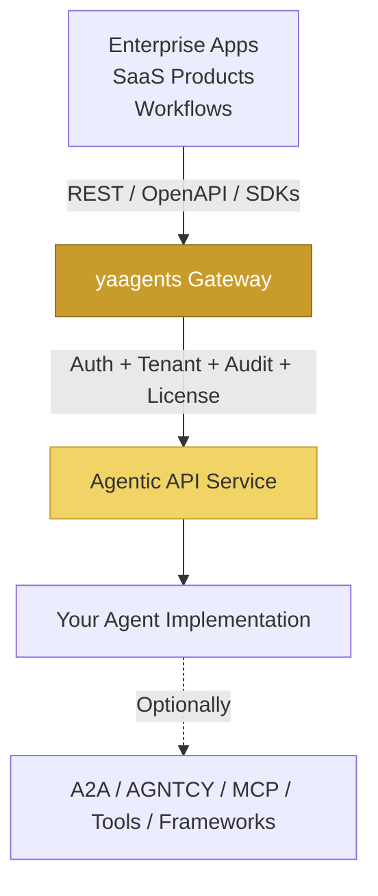

import { Badge } from '@astrojs/starlight/components';

# yaagents vs A2A / AGNTCY / MCP / frameworks <Badge text="Stable" variant="success" />

yaagents solves a narrower production problem than the agent infrastructure landscape:

> How should enterprise applications expose and consume agentic capabilities using the REST, OpenAPI, gateway, RBAC, tenant, audit, observability, and SDK patterns they already use?

## One-line distinction

- **A2A / AGNTCY**: agent &harr; agent
- **MCP**: agent &harr; tool/context
- **LangGraph / LangChain / CrewAI / Semantic Kernel**: build agent logic
- **yaagents**: application &harr; agentic capability

## Where yaagents fits



*yaagents governs the application&harr;agent boundary. Agent frameworks, A2A, AGNTCY, and MCP can still operate behind that boundary.*

## What yaagents does (v0.3)

yaagents defines a resource-oriented REST profile and gateway pattern for exposing agentic operations as ordinary domain APIs:

```http
POST /products/{id}/recommendations        ← shipped example (store)
POST /campaigns/{id}/optimizations         ← shipped alternative example
POST /tickets/{id}:triage                  ← v0.3 tutorial subject (you build it)
```

Instead of:

```http
POST /agents/invoke
```

Concretely, v0.3 standardizes:

- **Typed outcomes** via `AgenticResponse.success / created / accepted / clarification_required / validation_failed / failed_dependency / error`
- **Vendor media types** (`application/vnd.yaagents.agentic+json`, `application/vnd.yaagents.error+json`)
- **Profile version header** (`X-YAAgents-Profile: v0.3`)
- **Gateway plugin chain** — token-validator (always-on), tenant-injector (default-on), license-check (default-on)
- **5 published packages** — sdk-fastapi (Python server), sdk-go (Go server), client-python, client-ts, client-go, plus the CLI and gateway image
- **`@agentic_operation` decorator** for Python (sdk-fastapi) and `AgenticResponse` builders for Go (sdk-go)

:::note[Plugin status (v0.3)]
`token-validator`, `tenant-injector`, and `license-check` are fully functional in v0.3.
`prompt-sanitize` and `otel-audit` are registered stubs — their plugin interfaces are in place but the implementation ships in v0.4.
:::

## What yaagents does NOT do

yaagents does not prescribe:

- Which LLM you use
- Which agent framework you use
- How agents reason internally
- How multiple agents coordinate internally
- How tools are discovered
- How agent memory is stored
- How A2A, AGNTCY, or MCP should be implemented internally

## How yaagents complements A2A, AGNTCY, MCP, and frameworks

A business application should not have to know that an order-fulfillment agent internally talks to five other agents.

The app calls:

```http
POST /orders/{id}/fulfillment-plans
```

Internally, the order-fulfillment implementation may use:

- A2A to collaborate with an inventory-check agent
- AGNTCY for agent discovery / identity / messaging
- MCP to call warehouse APIs and shipping rate tools
- LangGraph or CrewAI for orchestration
- Direct Anthropic / OpenAI SDK calls

yaagents keeps the external enterprise API stable while the internal agent architecture evolves.

## Comparison table

| Capability | yaagents v0.3 | A2A | AGNTCY | MCP | LangGraph / LangChain / CrewAI / SK |
|---|---|---|---|---|---|
| Primary relationship | Application &harr; agentic capability | Agent &harr; agent | Agent ecosystem infrastructure | Agent &harr; tool/context | Developer &harr; agent logic |
| Resource-oriented REST APIs | **Yes** | Not primary | Not primary | No | No, not primary |
| OpenAPI-friendly business endpoints | **Yes** | Not primary | Not primary | Not primary | Custom |
| Gateway RBAC + tenant boundary | **Yes** | Not primary | Identity/messaging focus | No | Custom |
| Typed HTTP outcome profile | **Yes** | Different protocol model | Different infrastructure model | Tool protocol | Custom |
| Agent discovery/collaboration | No | **Yes** | **Yes** | No | Framework-specific |
| Tool/context integration | No | No | Partial/ecosystem | **Yes** | Often yes |
| Agent implementation framework | No | No | No | No | **Yes** |
| Best used for | Exposing production agent APIs | Agent interoperability | Multi-agent infrastructure | Tool access | Building agent logic |

## Positioning summary

- Use **yaagents** when you need to expose an agentic capability as a governed enterprise REST API.
- Use **A2A or AGNTCY** when agents need to discover, communicate, or collaborate with other agents.
- Use **MCP** when agents need to access tools, data, or external context.
- Use **LangGraph, LangChain, CrewAI, Semantic Kernel, or custom code** to build the actual agent logic.

yaagents can sit in front of all of them.
