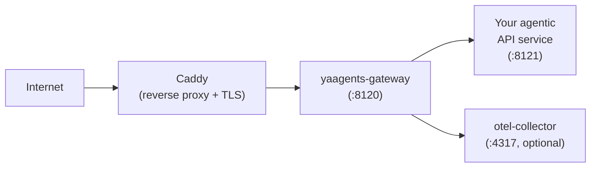

import { Steps, Aside, Code, LinkCard, CardGrid } from '@astrojs/starlight/components';

## Overview

This guide covers a **single-VM deployment** — one host running all containers
behind a Caddy reverse proxy with automatic TLS. This is the recommended starting
point for small to medium production workloads before you need horizontal scaling.

**What this guide covers:**
- Docker Compose service layout (gateway + your agentic API service + optional OTLP collector)
- Caddy reverse proxy with automatic Let's Encrypt TLS
- DNS and firewall prerequisites
- Verification and log tailing

**What this guide does not cover:**
- Kubernetes or Helm (see [PI5-yaa OR community contribution welcome — Helm chart](#going-to-production))
- Cloud-provider-specific infrastructure (yaagents is cloud-agnostic; no AWS/GCP/Azure details here)
- Multi-VM horizontal scaling (that's the Helm/K8s path)

## Architecture target



The Caddy proxy terminates TLS and forwards to the yaagents gateway on port 8120.
The gateway routes to your agentic API service. All containers run on the same Docker
bridge network — no inter-container traffic leaves the host.

For Kubernetes deployments, see: **PI5-yaa OR community contribution welcome — Helm chart.**
A Helm chart is on the public roadmap ([GitHub Issues](https://github.com/ai-mpathyminds/yaagents/issues)).

## Prerequisites

Before starting:

- A Linux VM (1 vCPU, 1 GB RAM minimum; 2+ recommended for production)
- Docker Engine 24+ and Docker Compose v2 installed
- A domain name with DNS A record pointing at the VM's public IP
- TCP ports 80 and 443 open inbound (for Let's Encrypt and HTTPS traffic)
- Your agentic API service container image (or build it locally from `examples/store/`)

## Step-by-step

<Steps>
1. **Clone the deploy repository or create a deployment directory.**

   If starting from scratch, create a directory on the VM:
   ```bash
   mkdir -p ~/yaagents-prod && cd ~/yaagents-prod
   ```

2. **Write `docker-compose.yml`.**

   Create `docker-compose.yml` with the gateway, your service, and Caddy:

   ```yaml
   services:
     gateway:
       image: ghcr.io/ai-mpathyminds/yaagents-gateway:0.3.0
       restart: unless-stopped
       ports:
         - "127.0.0.1:8120:8120"
       environment:
         GATEWAY_CONFIG: /etc/yaagents/gateway.yaml
       volumes:
         - ./gateway.yaml:/etc/yaagents/gateway.yaml:ro
       healthcheck:
         test: ["CMD", "wget", "-qO-", "http://localhost:8120/healthz"]
         interval: 10s
         timeout: 5s
         retries: 3

     my-service:
       image: my-registry/my-agentic-service:latest
       restart: unless-stopped
       ports:
         - "127.0.0.1:8121:8121"
       environment:
         SERVICE_PORT: "8121"
       healthcheck:
         test: ["CMD", "wget", "-qO-", "http://localhost:8121/readyz"]
         interval: 10s
         timeout: 5s
         retries: 3

     caddy:
       image: caddy:2-alpine
       restart: unless-stopped
       ports:
         - "80:80"
         - "443:443"
       volumes:
         - ./Caddyfile:/etc/caddy/Caddyfile:ro
         - caddy_data:/data
         - caddy_config:/config

   volumes:
     caddy_data:
     caddy_config:
   ```

3. **Write `Caddyfile`.**

   Replace `api.yourdomain.com` with your domain:

   ```
   api.yourdomain.com {
     reverse_proxy gateway:8120
   }
   ```

   Caddy handles TLS certificate provisioning automatically via Let's Encrypt.
   No certificate files to manage.

4. **Write `gateway.yaml`.**

   Minimal gateway config pointing at your service:

   ```yaml
   upstream:
     url: http://my-service:8121
   plugins:
     token-validator:
       enabled: true
       issuers:
         - iss: https://auth.yourdomain.com/realms/yourealm
           jwks_uri: https://auth.yourdomain.com/realms/yourealm/protocol/openid-connect/certs
     tenant-injector:
       enabled: true
       principal:
         claim: sub
       lookup:
         url: http://my-service:8121/internal/tenant/{principal}
         timeout_ms: 500
     otel-audit:
       enabled: true
       exporter: stdout
   ```

   See the [Plugin overview](/yaagents/plugins/) for all plugin configuration options.

5. **Start the stack.**

   ```bash
   docker compose up -d
   ```

   On first start, Caddy automatically fetches a Let's Encrypt certificate. This
   requires ports 80 and 443 to be open and DNS to resolve to the VM.

6. **Verify HTTPS.**

   Wait 30–60 seconds for the certificate to provision, then:

   ```bash
   curl -sf https://api.yourdomain.com/healthz
   # Expected: {"status":"ok"}

   curl -sf https://api.yourdomain.com/readyz
   # Expected: {"status":"ok"}
   ```

   If the gateway returns `200`, TLS is working and the gateway is healthy.

</Steps>

<Aside type="caution">
  **Health-check timing**: on first boot the gateway may take 5–10 seconds to reach
  healthy state after the container starts. If `curl /healthz` returns a connection
  error immediately after `docker compose up -d`, wait and retry — do not assume
  misconfiguration.
</Aside>

## Going to production

Once the stack is running, consider these operational notes:

- **Log aggregation**: `docker compose logs -f gateway my-service` tails all logs.
  For production, ship stdout to a log aggregator (Loki, Datadog, CloudWatch) by
  configuring the Docker logging driver in `docker-compose.yml`.
- **Metrics**: the gateway exposes Prometheus metrics at `http://localhost:8120/metrics`.
  Scrape this with Prometheus or ship via the OTLP collector (`otel-audit` plugin in
  `exporter: otlp` mode).
- **Backups**: no persistent gateway state to back up. Back up `gateway.yaml` alongside
  your application data.
- **Scaling**: single-VM scaling means a bigger VM. Horizontal scaling requires container
  orchestration — see below.
- **Kubernetes / Helm chart**: a Helm chart for Kubernetes deployments is on the roadmap.
  **PI5-yaa OR community contribution welcome** — see
  [GitHub Issues](https://github.com/ai-mpathyminds/yaagents/issues) for the tracking issue.
  The yaagents architecture is stateless-gateway-friendly; horizontal scaling needs only
  a shared session source (already handled by JWT validation, not gateway state).

## Where to go next

<CardGrid>
  <LinkCard title="Plugin pipeline" href="/yaagents/plugins/" description="Configure token-validator, tenant-injector, license-check, prompt-sanitize, and otel-audit." />
  <LinkCard title="Observability" href="/yaagents/architecture/inter-agent-calls/" description="Correlation-ID propagation, audit spans, and Prometheus metrics." />
  <LinkCard title="Profile spec" href="https://github.com/ai-mpathyminds/yaagents/blob/main/spec/agentic-rest-profile.md" description="Agentic REST Response Profile v0.3 — the normative response contract." />
</CardGrid>
