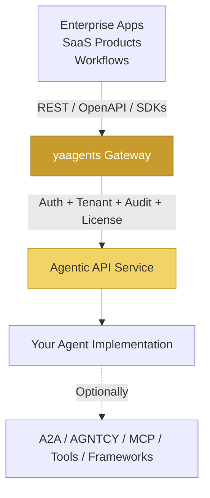

import { Card, CardGrid } from '@astrojs/starlight/components';
import AgentCard from '../../components/aimpathy/AgentCard.tsx';

<AgentCard
  client:visible
  name="campaign-optimizer"
  role="optimization"
  status="done"
  scope="tenant-001"
  trail={[
    { label: "POST /campaigns/c-42/optimizations", time: "0s" },
    { label: "3 candidate variations enumerated", time: "120ms" },
    { label: "2 approved by approval-spine", time: "340ms" },
    { label: "$0.12 spent · response 201 Created", time: "1.4s" }
  ]}
/>

## The pattern shift

```http
# Prototype pattern (don't do this)
POST /agents/invoke

# yaagents pattern
POST /campaigns/{id}/optimizations
POST /products/{id}/recommendations
POST /tickets/{id}:triage
```

yaagents is the **application-to-agent boundary**. A2A and AGNTCY
help agents talk to agents; MCP helps agents call tools; yaagents
helps applications talk to agents through governed REST APIs.

## What yaagents is

- An **Agentic REST Profile** (resource-oriented operations with typed outcomes)
- A **gateway pattern** for production agent APIs (auth + tenant + audit + license)
- A **typed response contract** (`AgenticResponse.success/clarification_required/validation_failed/...`)
- A **framework-neutral boundary** around agentic capabilities

## What yaagents is NOT

- Not an agent framework (use LangGraph / CrewAI / Semantic Kernel for that)
- Not a chatbot framework
- Not an A2A replacement (those help agents talk to agents)
- Not an MCP replacement (that helps agents call tools)
- Not a model provider abstraction (use Anthropic SDK / OpenAI SDK directly)
- Not an autonomous multi-agent orchestration runtime

## Where yaagents fits



*yaagents governs the application&harr;agent boundary. Agent frameworks, A2A, AGNTCY, and MCP can still operate behind that boundary.*

## Who uses yaagents?

<CardGrid>
  <Card title="🏗️ SaaS product teams" icon="rocket">
    Add AI agents behind your existing product APIs without rebuilding your auth or tenant stack.

    **Example:** `POST /campaigns/{id}/optimizations` — the agent proposes campaign changes; your existing RBAC decides who can trigger it.

    [See the campaign-api example →](/yaagents/examples/campaign-api/)
  </Card>
  <Card title="🔒 Platform engineering teams" icon="setting">
    Govern every agent API centrally — one gateway config for auth, tenancy, license quotas, and audit.

    **Plugin chain:** `token-validator → tenant-injector → license-check → audit`

    [Plugin interface reference →](/yaagents/reference/plugin-interface/)
  </Card>
  <Card title="📐 API architects" icon="document">
    Keep your OpenAPI contracts and SDK discipline intact even as the implementation becomes agentic.

    **Media types:** `application/vnd.yaagents.clarification+json`, `application/vnd.yaagents.agentic+json`

    [Profile v0.3 spec →](/yaagents/reference/profile-v03/)
  </Card>
  <Card title="🤖 Multi-agent builders" icon="puzzle">
    Hide internal agent collaboration behind stable REST APIs — downstream callers don't need to know you have 5 agents inside.

    **v0.4 example:** `POST /claims/{id}/reviews` — one endpoint; arbitrarily complex agent graph behind it.

    [yaagents vs A2A / AGNTCY / MCP →](/yaagents/explanation/yaagents-vs-a2a-agntcy-mcp/)
  </Card>
</CardGrid>


## What brings you here today?

<CardGrid>
  <Card title="🎓 Learn" icon="open-book">
    **Tutorials.** Get from zero to a working agent service in 10 minutes.

    [Start the tutorial →](/yaagents/tutorials/quick-start/)
  </Card>
  <Card title="🎯 Solve" icon="puzzle">
    **How-to Guides.** Add OAuth. Deploy to K8s. Wire OTEL. Seven worked recipes.

    [Browse how-tos →](/yaagents/how-to/tenant-injection/)
  </Card>
  <Card title="📚 Reference" icon="document">
    **Profile spec, gateway config, plugin API, all five SDKs, OpenAPI, JSON Schemas.**

    [Open reference →](/yaagents/reference/profile-v03/)
  </Card>
  <Card title="🧠 Understand" icon="rocket">
    **Why resource-oriented?** How the plugin model works. Where yaagents fits vs A2A, AGNTCY, MCP, and frameworks.

    [Read the explanations →](/yaagents/explanation/why-yaagents/)
  </Card>
</CardGrid>

## Try it in 30 seconds

```bash
# Run the gateway
docker run -p 8120:8080 ghcr.io/ai-mpathyminds/yaagents-gateway:0.3.0

# Build an agent service (Python)
pip install yaagents-fastapi

# OR (Go)
go get github.com/ai-mpathyminds/yaagents-sdk-go

# Call from your app
pip install yaagents-client
```

[Continue with Quick Start →](/yaagents/tutorials/quick-start/)

---

Apache 2.0 · v0.3.0 · Python · Go · TypeScript
