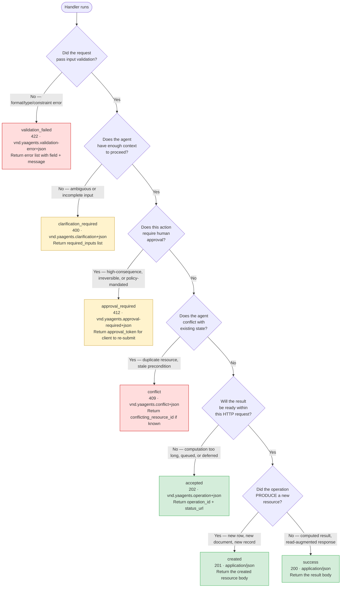

import { Badge } from '@astrojs/starlight/components';

# Typed Outcome Decision Flow <Badge text="Stable" variant="success" />

Use this decision tree when implementing an `@agentic_operation` handler to choose
the correct `AgenticResponse` factory method.

---

## Decision tree



---

## Per-branch caption

### `validation_failed` — 422

Request inputs did not satisfy the schema or business constraints.
Your agent did not run. Return a structured `errors` list:

```python
return AgenticResponse.validation_failed(
    errors=[{"field": "budget", "message": "Must be a positive number"}],
    correlation_id=ctx.correlation_id,
    request_id=ctx.request_id,
)
```

### `clarification_required` — 400

The request was well-formed but the agent cannot produce a useful result without
additional context. The caller should collect the missing inputs and re-submit.

```python
return AgenticResponse.clarification_required(
    required_inputs=[{
        "name": "target_segment",
        "description": "Which audience segment to optimize for: 'ctr' or 'revenue'",
        "type": "string",
        "enum": ["ctr", "revenue"],
    }],
    message="Please specify the optimization target.",
    correlation_id=ctx.correlation_id,
    request_id=ctx.request_id,
)
```

This is the canonical campaign-optimizer pattern — the agent knows the campaign but
not the optimization objective.

### `approval_required` — 412

The action would have consequences that require a human gate (budget threshold exceeded,
irreversible deletion, compliance-mandated sign-off). Return an `approval_token` the
client can present when re-submitting after approval.

```python
return AgenticResponse.approval_required(
    approval_token="approv-xyz789",
    message="This optimization would reallocate >$10,000. Manager approval required.",
    correlation_id=ctx.correlation_id,
    request_id=ctx.request_id,
)
```

### `conflict` — 409

The state the agent attempted to produce already exists, or a precondition was not met.

```python
return AgenticResponse.conflict(
    code="OPTIMIZATION_ALREADY_EXISTS",
    message="An active optimization for campaign c-42 is already running.",
    conflicting_resource_id="opt-9900",
    correlation_id=ctx.correlation_id,
    request_id=ctx.request_id,
)
```

### `accepted` — 202

The agent computation is long-running. Return an `operation_id` and a `status_url`
for the caller to poll.

```python
return AgenticResponse.accepted(
    operation_id=str(uuid.uuid4()),
    status_url=f"/campaigns/{campaign_id}/optimizations/{op_id}/status",
    correlation_id=ctx.correlation_id,
    request_id=ctx.request_id,
)
```

*Polling endpoint is v0.4 scope. In v0.3, clients may use webhooks or polling
on the resource URL.*

### `created` — 201

The agent produced a new persistent resource. Return the resource body.

```python
return AgenticResponse.created(
    {"optimizationId": opt_id, "variants": [...], "estimatedImpact": 0.23},
    correlation_id=ctx.correlation_id,
    request_id=ctx.request_id,
)
```

### `success` — 200

The agent returned a computed result without creating a new persistent resource.
Common for read-augmented or recommendation endpoints.

```python
return AgenticResponse.success(
    {"recommendations": [...], "confidence": 0.87},
    correlation_id=ctx.correlation_id,
    request_id=ctx.request_id,
)
```

---

## Infrastructure outcomes (not in the decision tree)

The three infrastructure outcomes (`forbidden`, `failed_dependency`, `error`) are
not in the decision tree because they originate from the gateway or from unhandled
exceptions, not from deliberate domain logic. Best practice:

- Let the SDK's error handler emit `error` (500) for uncaught exceptions
- Return `forbidden` explicitly only if your service performs secondary RBAC beyond
  the gateway's token validation
- Use `failed_dependency` when a required downstream service (database, external API)
  is unavailable and the operation cannot proceed or be queued

---

[Read next → Examples Overview →](/yaagents/examples/overview/)
