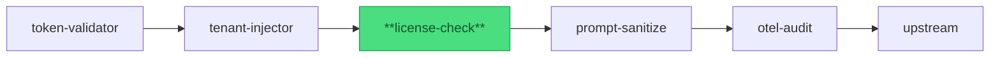

import { Badge, Aside, Code } from '@astrojs/starlight/components';

<Badge text="Stable" variant="success" />

## Purpose

The **license-check** plugin enforces per-tenant feature entitlements on every request.
It reads a license token from a configured request header, verifies the token against
a remote license server, and caches results with a bounded LRU cache. Rather than
reimplementing license verification in every upstream service, the gateway handles
it once and forwards only requests bearing a valid, active license.

Pipeline position:



*license-check is pipeline position 3 — runs after tenant identity is established by tenant-injector.*

## Config

<Code lang="yaml" title="gateway.yaml (license-check block)" code={`
license-check:
  license_url: https://license-svc.internal/verify   # required; absolute http/https URL
  header: X-License-Token                            # request header carrying the token (default)
  cache_ttl_seconds: 300                             # how long to cache a valid verification (default)
  max_cache_size: 1024                               # LRU cache capacity in entries (default)
  timeout_seconds: 5                                 # HTTP client timeout per verification call (default)
`} />

| Field | Type | Default | Required | Description |
|---|---|---|---|---|
| `license_url` | string (URL) | — | yes | Absolute `http://` or `https://` URL of the license server. Gateway exits at Init if absent or malformed. |
| `header` | string | `"X-License-Token"` | no | Request header name that carries the license token. |
| `cache_ttl_seconds` | integer | `300` | no | How long a successful license-server verification is cached per token value. |
| `max_cache_size` | integer | `1024` | no | Maximum number of cached entries. Oldest entries evicted (LRU) when full. |
| `timeout_seconds` | integer | `5` | no | HTTP client hard timeout for each license-server request. |

<Aside type="caution">
  **`license_url` is the only required field** — the gateway will not start without it.
  Point `license_url` at an endpoint that accepts the raw token (passed as a query parameter
  or request body — check your license server's API) and returns a 2xx response for valid
  tokens and a non-2xx for invalid ones. A misconfigured URL that always returns 200 will
  allow all requests regardless of token validity.
</Aside>

## Request/Response

### Reads from request

| Source | Field | How used |
|---|---|---|
| Request header | `header` (default `X-License-Token`) | Token value extracted and sent to license server for verification. |
| Request context | `X-Tenant-ID` (from tenant-injector) | Available in reqctx; not directly used by this plugin but present for license-server correlation if the `license_url` is tenant-scoped. |

### Writes to request (before forwarding upstream)

This plugin does not add or modify request headers. The license token header is
forwarded unchanged to the upstream — the upstream may inspect it independently if
needed, but the gateway has already verified it.

### Writes to response

This plugin does not modify responses. It may return an early rejection response
(see Status codes below) before the upstream is contacted.

### Status codes the plugin can return early

| Status | Media type | When |
|---|---|---|
| `403` | `application/vnd.yaagents.error+json` | License token absent, or license server returns a non-2xx response (invalid / revoked / unknown token). Response body includes `dependency: "license-server"` on server-side failures to distinguish policy rejection from infrastructure failure. |
| `503` | `application/vnd.yaagents.error+json` | License server unreachable (connection refused, DNS fail) or `timeout_seconds` exceeded. Response body includes `dependency: "license-server"`. |

## Security & privacy

### What this plugin trusts

- The license token value present in `header` — extracted verbatim and forwarded to `license_url` for verification. The plugin does not parse or validate the token structure itself; it delegates validity determination entirely to the license server.
- The license server's HTTP response code — a 2xx means valid; anything else means invalid or unreachable.
- The LRU cache state — a cached positive result is trusted for `cache_ttl_seconds` without re-verification.

### What this plugin protects

- **Unlicensed access**: requests without a valid license token are rejected at the gateway before reaching any upstream service.
- **Revoked licenses**: the cache TTL is the maximum window in which a revoked license continues to be accepted. Shorter `cache_ttl_seconds` values reduce this window at the cost of more license-server calls.

### PII boundary

The license token (value of the `header` field) is forwarded to the license server for
verification. It is **not logged** in any log line or span attribute. The license
server response (2xx vs non-2xx) is the only signal the plugin retains — no token
payload is inspected, parsed, or stored beyond the LRU cache key (the raw token string,
in memory only).

`X-Tenant-ID` and actor principal headers are present in the request context but are
not read or logged by this plugin.

### Secrets handling

This plugin handles no secrets directly. The license token is a per-request
client-supplied value; no API keys or credentials are loaded from config. If
`license_url` is an authenticated endpoint, authentication should be handled at the
network layer (mTLS, VPN, or IP allowlist) — there is no `auth` config block in this
plugin's surface.

## Observability

### Spans / events emitted

| Span name | Attributes | When emitted |
|---|---|---|
| `license.check` | `outcome` (`cache_hit` \| `valid` \| `invalid` \| `error`), `dependency` (`license-server` on non-hit) | Every request. |
| `license.verify` | `url` (host only), `status`, `latency_ms` | On cache miss — when a network verification call is made. |

**Bench baseline (BENCH-3; commit c023513; 2026-06-07):** p99 overhead **+280 ms** on a
cache miss (network call to mock license server included); **−1 ms** on cache hit (well
within noise floor). The 280 ms figure reflects the full round-trip to the license server
— tune `cache_ttl_seconds` to maximise cache-hit rate in production. At 300 s TTL and
steady-state traffic, cache hits dominate and per-request overhead is sub-millisecond.
See `architecture/audit-and-observability.mdx` (DOC-05 — ships PI4-yaa S5) for the
full bench baseline archive.

### Log lines

```json
{"level":"INFO","msg":"license.check","outcome":"cache_hit","request_id":"req-001"}
{"level":"WARN","msg":"license.verify","outcome":"invalid","status":403,"dependency":"license-server","request_id":"req-002"}
{"level":"ERROR","msg":"license.verify","outcome":"error","error":"connection refused","dependency":"license-server","request_id":"req-003"}
```

No token values appear in any log line. WARN on invalid token; ERROR on network/timeout failure.

### Metrics

| Metric | Type | Labels | Description |
|---|---|---|---|
| `yaagents_plugin_license_check_total` | counter | `outcome` | Cumulative checks by outcome (`cache_hit`, `valid`, `invalid`, `error`). |
| `yaagents_plugin_license_verify_duration_seconds` | histogram | `status` | License-server round-trip latency on cache misses. |
| `yaagents_plugin_license_cache_size` | gauge | — | Current LRU cache occupancy. |

### Correlation-id propagation

Reads `X-Correlation-ID` from the inbound request and attaches it as the
`correlation_id` attribute on the `license.check` and `license.verify` spans.
`X-Correlation-ID` is forwarded unchanged to the upstream (per PRD §9 gateway
responsibilities). The correlation ID is also sent as a request header on the
outbound license-server verification call — so the license server's own traces
carry the same correlation ID as the originating gateway request.

## Failure modes

| Failure | Configurable behavior | What the client sees |
|---|---|---|
| `header` absent from request | Fixed 403 (not configurable) | `403 application/vnd.yaagents.error+json` |
| License server returns non-2xx (invalid token) | Fixed 403 | `403 application/vnd.yaagents.error+json` with `dependency: "license-server"` |
| License server unreachable (connection refused / DNS) | Fixed 503 | `503 application/vnd.yaagents.error+json` with `dependency: "license-server"` |
| License server timeout (`timeout_seconds` exceeded) | Fixed 503 | `503 application/vnd.yaagents.error+json` with `dependency: "license-server"` |
| LRU cache full | LRU evicts oldest entry; next request for that token goes to license server | Transparent to client (no error); eviction logged at DEBUG. |
| `license_url` absent at Init | Gateway exits 1 at startup | Gateway does not start. |

<Aside type="tip">
  Every failure mode in this table has a corresponding e2e test in
  `gateway/internal/plugins/licensecheck/licensecheck_e2e_test.go`.
  Per [integration-test discipline](https://github.com/ai-mpathyminds/yaagents/blob/main/.claude/rules/integration-test-discipline.md),
  these tests fail loud when infrastructure is unreachable — they are never silently skipped.
</Aside>
