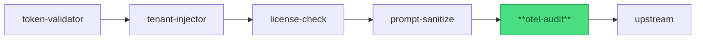

import { Badge, Aside, Code } from '@astrojs/starlight/components';

<Badge text="Stable" variant="success" />

## Purpose

The **otel-audit** plugin emits one audit record per gateway-proxied request, using
either a structured stdout log line (default, zero-config) or an OpenTelemetry span
exported via gRPC OTLP. Audit fields mirror the sdk-go `AuditEvent` schema so that
gateway-level observability and service-SDK observability share one consistent contract
documented in `architecture/audit-and-observability.mdx` — operators read a single
reference instead of two diverging schemas.

Pipeline position:



*otel-audit is pipeline position 5 — the last plugin before the upstream. It sees the fully-enriched request context (validated JWT, resolved tenant, license confirmed, sanitized body).*

## Config

<Code lang="yaml" title="gateway.yaml (otel-audit block)" code={`
otel-audit:
  enabled: true
  exporter: stdout          # stdout (default) | otlp
  otlp_endpoint: ""         # required when exporter: otlp (e.g. http://otel-collector:4317)
  include_request_body: false  # default false — set true only if body content is non-sensitive
  attributes:
    - tenant_id: from_header X-Tenant-ID
    - actor:     from_claim  sub
    - operation: from_route_id
`} />

| Field | Type | Default | Required | Description |
|---|---|---|---|---|
| `enabled` | bool | `true` | no | Set to `false` to disable the plugin (tracer becomes a no-op). |
| `exporter` | string | `"stdout"` | no | `stdout` — structured slog JSON line per request; `otlp` — OTel span via gRPC OTLP. |
| `otlp_endpoint` | string | `""` | yes (when `exporter: otlp`) | gRPC OTLP endpoint URL (e.g. `http://otel-collector:4317`). Must be an absolute URL. Init fails if empty when `exporter: otlp`. |
| `include_request_body` | bool | `false` | no | When `true`, the request body (up to 1 MiB) is included as an audit attribute. Default `false` guards against PII leakage into audit records. |
| `attributes` | list | see below | no | Attribute source mappings. Each entry specifies a target field name and a source directive (`from_header`, `from_claim`, `from_route_id`). |

**Default attributes emitted** (always, regardless of `attributes` config):
`event_type` (fixed `"agentic.request.received"`), `tenant_id` (from `X-Tenant-ID` header),
`actor_id` (from validated JWT `sub` claim), `request_id` (from `X-Request-ID`),
`correlation_id` (from `X-Correlation-ID`), `operation` (from route ID), `outcome`
(set post-upstream: `success` or `error`), `timestamp` (RFC3339 UTC).

<Aside type="caution">
  **`include_request_body: true`** copies request body content into audit records. If the
  body contains PII (names, email addresses, health data) or secrets, those values will
  appear in your OTLP collector, log aggregator, or stdout. Enable only when the body
  content is known to be non-sensitive AND your audit storage meets the same compliance
  requirements as the upstream that processes the body.
</Aside>

## Request/Response

### Reads from request

| Source | Field | How used |
|---|---|---|
| Request header | `X-Tenant-ID` | Written as `tenant_id` audit attribute. |
| Request header | `X-Actor-Principal` | Written as `actor_id` audit attribute (falls back to JWT `sub` claim if absent). |
| Request header | `X-Correlation-ID` | Written as `correlation_id` audit attribute; propagated to span context. |
| Request header | `X-Request-ID` | Written as `request_id` audit attribute. |
| Request context (from token-validator) | JWT `sub` claim | Actor identity; used when `X-Actor-Principal` is absent. |
| Route metadata | Route ID | Written as `operation` audit attribute. |
| Request body | Raw bytes (when `include_request_body: true`) | Written as `request_body` audit attribute (truncated at 1 MiB). |

### Writes to request (before forwarding upstream)

This plugin does not modify the forwarded request. All observability is emitted as
side-channel output (stdout line or OTLP span); the request reaches the upstream
unchanged.

### Writes to response

This plugin does not modify upstream responses. The `outcome` attribute (`success` or
`error`) is set after the upstream handler returns, then the audit record is finalized
and emitted.

### Status codes the plugin can return early

This plugin does not return early rejection responses. If the OTLP exporter is
unreachable, the plugin's behavior is configurable (see §6 Failure modes) — but it
never rejects requests on behalf of observability failures.

## Security & privacy

### What this plugin trusts

- Headers set by earlier pipeline plugins (token-validator, tenant-injector) — these are trusted gateway-internal values at this pipeline position.
- The OTLP collector endpoint (when `exporter: otlp`) — data is sent without payload-level encryption beyond what the transport provides. Use TLS on the OTLP endpoint for sensitive audit data.

### What this plugin protects

- **Non-repudiation**: every request passing through the gateway produces an immutable audit record with tenant, actor, operation, and correlation ID. Gateway operators have a complete audit trail even if upstream services do not emit their own logs.

### PII boundary

Span attributes include `tenant_id` and `actor_id` — both are treated as
semi-sensitive (opaque identifiers rather than personal names). Neither value is a
PII category in most jurisdictions, but they can be used to correlate behavior to
an individual.

When `include_request_body: false` (the default), body content **never appears** in
audit records. When `true`, body content does appear — see the caution in §2 Config
for the compliance posture required.

The audit record is emitted **after** prompt-sanitize has processed the request — so
if prompt-sanitize redacted PII from the body, the redacted body (not the original)
is what `include_request_body: true` would capture.

### Secrets handling

- **OTLP endpoint** is a URL (not a credential) — no token or API key is loaded.
- If the OTLP collector requires authentication, configure it at the collector's
  reverse proxy layer, not via this plugin. The plugin sends unauthenticated gRPC.
- `include_request_body` is the only configuration that could pull secret material
  into audit records; leave it `false` (default) unless the body content is auditable
  by policy.

## Observability

### Spans / events emitted

| Span / log name | Attributes | When emitted |
|---|---|---|
| `agentic.request` (OTLP span) OR stdout JSON line | `event_type`, `tenant_id`, `actor_id`, `request_id`, `correlation_id`, `operation`, `outcome`, `timestamp`, `request_body` (opt.) | Every request when `enabled: true`. |

**Schema**: attribute field names match sdk-go `AuditEvent` JSON tag names exactly —
`event_type`, `tenant_id`, `actor_id`, `request_id`, `correlation_id`, `operation`,
`resource_id`, `outcome`, `timestamp`. This alignment is intentional and maintained
by cross-component contract (ADR PI4-yaa-0001 §6.2.5 + PLG-14 AC).

**Bench baseline (BENCH-5; commit ab48611; 2026-06-07):**
- `exporter: stdout`: p99 overhead **+36.8 ms** vs no-plugin baseline (slog structured
  write to stdout; dominated by I/O flush).
- `exporter: otlp`: p99 overhead **+5.9 ms** vs no-plugin baseline (gRPC async export to
  mock OTLP collector; batched export hides most latency).

In production, OTLP exporter typically has lower latency impact than stdout because
spans are exported asynchronously in batches. The stdout figure is pessimistic for
production use where stdout is a log aggregator pipe rather than a terminal.

See `architecture/audit-and-observability.mdx` (DOC-05 — ships PI4-yaa S5) for the
full bench baseline archive and detailed latency breakdowns.

### Log lines

**Stdout exporter** emits one structured slog line per request:

```json
{"level":"INFO","msg":"agentic.request","event_type":"agentic.request.received","tenant_id":"tenant-abc","actor_id":"usr-xyz","request_id":"req-001","correlation_id":"corr-001","operation":"POST /api/v1/campaigns","outcome":"success","timestamp":"2026-06-07T19:00:00Z"}
```

**OTLP exporter** emits no stdout lines — spans are exported to the configured OTLP collector.

### Metrics

| Metric | Type | Labels | Description |
|---|---|---|---|
| `yaagents_plugin_otelaudit_emit_total` | counter | `exporter`, `outcome` | Cumulative audit records emitted by exporter type and emit outcome (`ok`, `error`). |
| `yaagents_plugin_otelaudit_emit_duration_seconds` | histogram | `exporter` | Time to emit one audit record (including OTLP export call or slog write). |

### Correlation-id propagation

Reads `X-Correlation-ID` from the inbound request and sets it as the `correlation_id`
attribute on the emitted audit record / span. For OTLP mode, `correlation_id` is also
propagated as the OTel trace context parent ID so the gateway span and upstream spans
share one trace tree. Forwarded unchanged to the upstream request.

## Failure modes

| Failure | Configurable behavior | What the client sees |
|---|---|---|
| OTLP collector unreachable (connection refused / timeout) | Span dropped silently; request proceeds. Emit failure logged at WARN + `yaagents_plugin_otelaudit_emit_total{outcome="error"}` incremented. | No impact on request outcome — fail-open by design. |
| OTLP gRPC stream error (partial batch) | Spans in failed batch dropped; next batch retried. | No impact on client. |
| Stdout write error (disk full / broken pipe) | Audit record dropped; WARN logged to stderr; request proceeds. | No impact on client. |
| `include_request_body: true` + body > 1 MiB | Body truncated to 1 MiB in audit record. | No impact on request; audit record carries truncated body. |
| `exporter: otlp` + `otlp_endpoint` empty | Fixed Init error — gateway exits 1. | Gateway does not start. |

<Aside type="tip">
  Every failure mode in this table has a corresponding e2e test in
  `gateway/internal/plugins/otelaudit/otelaudit_e2e_test.go`.
  Per [integration-test discipline](https://github.com/ai-mpathyminds/yaagents/blob/main/.claude/rules/integration-test-discipline.md),
  these tests fail loud when infrastructure is unreachable — they are never silently skipped.
</Aside>
