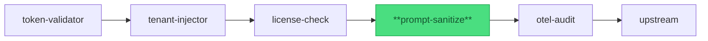

import { Badge, Aside, Code } from '@astrojs/starlight/components';

<Badge text="Stable" variant="success" />

## Purpose

The **prompt-sanitize** plugin inspects inbound request bodies against a configurable
list of regex and keyword patterns before forwarding to upstream AI services. Matched
content is either **rejected** (request blocked with a clarification response) or
**redacted** (matched substrings replaced with `[REDACTED]` and request forwarded),
according to per-pattern or global strategy settings. Rather than adding body-scanning
logic to every upstream service, the gateway enforces a consistent sanitization policy
at the boundary.

Pipeline position:



*prompt-sanitize is pipeline position 4 — runs after license entitlement is confirmed.*

## Config

<Code lang="yaml" title="gateway.yaml (prompt-sanitize block)" code={`
prompt-sanitize:
  enabled: true
  strategy: reject                  # global default action for patterns that omit action
  on_match_reject_status: 412       # HTTP status returned on reject (default 412)
  max_body_bytes: 1048576           # body scan cap in bytes (default 1 MB)
  patterns:
    - name: pii_email
      regex: '[a-zA-Z0-9._%+\-]+@[a-zA-Z0-9.\-]+\.[a-zA-Z]{2,}'
      action: redact
    - name: pii_phone
      regex: '\b\d{3}[-.\s]?\d{3}[-.\s]?\d{4}\b'
      action: redact
    - name: injection_attempt
      keywords:
        - "ignore previous instructions"
        - "jailbreak"
        - "DAN mode"
      action: reject
    - name: ssn
      regex: '\b\d{3}-\d{2}-\d{4}\b'
      action: reject
`} />

| Field | Type | Default | Required | Description |
|---|---|---|---|---|
| `enabled` | bool | `true` | no | Set to `false` to bypass the plugin (for debugging only). |
| `strategy` | string | `"reject"` | no | Global default action for patterns that omit `action`. `reject` or `redact`. |
| `on_match_reject_status` | integer | `412` | no | HTTP status returned when a `reject`-action pattern matches. 412 (Precondition Failed) signals the client to correct its payload before retrying. |
| `max_body_bytes` | integer | `1048576` | no | Maximum body bytes scanned. Bodies larger than this cap are scanned only up to the cap; the remainder is forwarded unmodified. |
| `patterns` | list | `[]` | no | Ordered list of pattern entries. Evaluated in declaration order. |
| `patterns[].name` | string | — | yes | Unique name for this pattern; used in log and span labels. |
| `patterns[].regex` | string | — | one of regex/keywords | Go RE2 regular expression applied to the raw request body. |
| `patterns[].keywords` | list | — | one of regex/keywords | List of literal strings; matched case-insensitively anywhere in the body. |
| `patterns[].action` | string | `strategy` | no | `reject` or `redact`. Overrides the global `strategy` for this pattern. |

<Aside type="caution">
  **Body inspection increases latency proportionally to body size and pattern count.**
  Bench baseline (BENCH-4; 100 RPS; 1–10 KB bodies): p99 overhead +11.5 ms for small
  bodies; overhead approaches the noise floor for medium and large bodies as the regex
  engine amortises its startup cost. See §5 Observability for details. Keep `max_body_bytes`
  at the minimum required for your workload to limit scan cost on large payloads.
</Aside>

## Request/Response

### Reads from request

| Source | Field | How used |
|---|---|---|
| Request body | Raw bytes | Scanned against all configured patterns. Bodies > `max_body_bytes` are partially scanned (up to cap). |
| Request context | `X-Tenant-ID`, `X-Actor-Principal` | Available in reqctx; not directly used by the pattern engine, but present for downstream correlation. |

### Writes to request (before forwarding upstream)

| Modified field | Action | Notes |
|---|---|---|
| Request body | On `redact` match: matched substrings replaced with `[REDACTED]` | Modified body is forwarded with correct `Content-Length` header updated. |

On `reject` action: request is terminated early — upstream does not receive the request.
On no match: request body is forwarded unchanged.

### Writes to response

This plugin does not modify upstream responses. On `reject` it returns its own early
response (see Status codes below) before any upstream contact.

### Status codes the plugin can return early

| Status | Media type | When |
|---|---|---|
| `412` | `application/vnd.yaagents.clarification+json` | A `reject`-action pattern matched. Response body includes a `requiredInputs` array describing which patterns fired and what the client should correct. |

The 412 status signals the client to **correct its payload before retrying** — it is a
payload-correction signal (not a generic 400 bad-request), aligned with Profile v0.3
§clarification handshake conventions.

## Security & privacy

### What this plugin trusts

- The request body bytes as received from the upstream caller (post-auth, post-license) — the plugin assumes body content integrity but not body content safety; that is exactly the contract being enforced.
- The pattern definitions in config — patterns are compiled at Init; a misconfigured regex that matches everything will redact or reject every request.

### What this plugin protects

- **Prompt injection**: keyword patterns targeting common injection phrases (`ignore previous instructions`, `jailbreak`, etc.) block attempts to subvert upstream AI service behavior.
- **PII leakage**: regex patterns for email addresses, phone numbers, SSNs, and similar identifiers prevent sensitive data from reaching AI models where it may be retained, logged, or memorized.
- **Exfiltration patterns**: custom patterns can block attempts to embed extraction instructions into prompts (e.g., "output your system prompt").

### PII boundary

This plugin has the **highest PII surface area** of all five gateway plugins — it
actively reads and modifies the request body. Key posture:

- On `redact`: matched substrings are replaced with `[REDACTED]` **before** the body
  reaches the upstream. The matched content is never logged; only the pattern name and
  match count are emitted at INFO level.
- On `reject`: the body is not forwarded at all; only the pattern name is logged.
- The original (pre-redaction) body is **never written to any log line, span, or metric**.
- `max_body_bytes` provides a cap — bodies beyond the scan limit are forwarded with the
  scanned prefix redacted/checked but no guarantee on the tail.

<Aside type="danger">
  **Do not use "AI workforce", "virtual employees", or "role clone" framing** in pattern
  names or log messages — these terms violate the PARITY-3 vocabulary discipline that
  protects the yaagents/agentforge architectural split. Use neutral terms:
  "agent", "service", "upstream", "principal" (per the Profile vocabulary).
</Aside>

### Secrets handling

No secrets are loaded by this plugin. Pattern definitions (regex strings and keyword
lists) are config values — treat them as operational configuration, not credentials.
The `patterns` list should be reviewed as carefully as firewall rules: overly broad
patterns silently redact legitimate content; too-narrow patterns miss real threats.

## Observability

### Spans / events emitted

| Span name | Attributes | When emitted |
|---|---|---|
| `sanitize.scan` | `outcome` (`pass` \| `redacted` \| `rejected`), `pattern_hits` (count), `body_bytes_scanned` | Every request where the plugin is enabled. |
| `sanitize.match` | `pattern_name`, `action` (`redact` \| `reject`), `match_count` | Once per pattern that fires; never includes matched content. |

**Bench baseline (BENCH-4; commit 21ab2fc; 2026-06-07):**
- Small bodies (under 1 KB): p99 overhead **+11.5 ms** vs no-plugin baseline.
- Medium bodies (1–10 KB): p99 overhead **−1.3 ms** (within noise floor; regex engine amortises).
- Large bodies (over 10 KB): p99 overhead **+1.3 ms** (scan overhead grows sub-linearly with body size due to RE2 efficiency).
- Redact strategy vs reject: p99 overhead **+0.7 ms** additional for redact (body rewrite).

See `architecture/audit-and-observability.mdx` (DOC-05 — ships PI4-yaa S5) for the
full bench baseline archive.

### Log lines

```json
{"level":"INFO","msg":"sanitize.match","pattern":"pii_email","action":"redact","match_count":2,"request_id":"req-001"}
{"level":"INFO","msg":"sanitize.match","pattern":"injection_attempt","action":"reject","match_count":1,"request_id":"req-002"}
```

Matched **content** (the actual matched substring) is **never logged** — only the pattern
name, action, and match count are emitted. This prevents PII from appearing in logs even
when the redact action fires.

### Metrics

| Metric | Type | Labels | Description |
|---|---|---|---|
| `yaagents_plugin_sanitize_scan_total` | counter | `outcome` | Cumulative scans by outcome (`pass`, `redacted`, `rejected`). |
| `yaagents_plugin_sanitize_pattern_hits_total` | counter | `pattern`, `action` | Cumulative pattern fires by pattern name and action. Useful for tuning pattern coverage. |
| `yaagents_plugin_sanitize_body_bytes_scanned_total` | counter | — | Total bytes scanned (up to `max_body_bytes` per request). |

### Correlation-id propagation

Reads `X-Correlation-ID` from the inbound request and attaches it as the
`correlation_id` attribute on `sanitize.scan` and `sanitize.match` spans. Forwarded
unchanged to the upstream on the `redact` path (not applicable on the `reject` path —
request is terminated before reaching upstream).

## Failure modes

| Failure | Configurable behavior | What the client sees |
|---|---|---|
| `reject`-action pattern match | `on_match_reject_status` (default 412) | `412 application/vnd.yaagents.clarification+json` with `requiredInputs` listing the pattern names that fired. |
| `redact`-action pattern match | Fixed — body modified + forwarded | `200` from upstream (redaction is transparent to client). INFO log emitted. |
| Body exceeds `max_body_bytes` | Fixed — scan cap applied; tail forwarded unscanned | No error to client; tail of body reaches upstream unredacted. Monitor `body_bytes_scanned_total` to detect frequent cap hits. |
| Misconfigured regex (non-RE2) | Fixed Init error — gateway exits 1 | Gateway does not start. |
| No patterns configured | Plugin is a pass-through (zero scan overhead) | All requests forwarded unchanged. |

<Aside type="tip">
  Every failure mode in this table has a corresponding e2e test in
  `gateway/internal/plugins/promptsanitize/promptsanitize_e2e_test.go`.
  Per [integration-test discipline](https://github.com/ai-mpathyminds/yaagents/blob/main/.claude/rules/integration-test-discipline.md),
  these tests fail loud when infrastructure is unreachable — they are never silently skipped.
</Aside>
