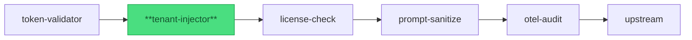

import { Badge, Aside, Code } from '@astrojs/starlight/components';

<Badge text="Stable" variant="success" />

## Purpose

The **tenant-injector** plugin resolves tenant identity for every validated request.
After the token-validator upstream has verified the JWT, tenant-injector calls a
configurable tenant-directory HTTP endpoint (substituting the actor principal into the
URL), caches the resolved tenant ID per principal, and injects `X-Tenant-ID` before
forwarding — so upstream services receive tenant context without performing their own
directory lookups.

Pipeline position:



*tenant-injector is pipeline position 2 — runs after token-validator has verified the JWT and populated the actor principal.*

## Config

<Code lang="yaml" title="gateway.yaml (tenant-injector block)" code={`
tenant-injector:
  enabled: true                              # required; false = Init error (defence-in-depth)
  principal:
    claim: sub                               # JWT claim used as principal identifier
  lookup:
    url: https://tenant-svc.internal/resolve/{principal}   # {principal} substituted per request
    method: GET                              # GET or POST (default: GET)
    timeout_ms: 500                          # default 500; max 30000
    auth:
      mode: none                             # none | bearer | mtls
      bearer_token_env: TENANT_LOOKUP_TOKEN  # env var with bearer token (mode: bearer)
      client_cert_path: /etc/certs/client.pem  # PEM cert (mode: mtls)
      client_key_path:  /etc/certs/client.key  # PEM key  (mode: mtls)
    headers:
      X-Internal-Caller: yaagents-gateway    # optional extra request headers
    response:
      mode: single                           # only "single" in v0.4; multi planned v0.5+
      tenant_id_field: tenant_id             # top-level JSON field in lookup response
    cache:
      ttl_seconds: 300                       # positive cache TTL (default 300)
      negative_ttl_seconds: 30               # negative cache TTL on 404/parse-fail (default 30)
      max_entries: 10000                     # LRU bound (default 10000)
  inject:
    tenant_header: X-Tenant-ID              # header injected into forwarded request
    principal_header: X-Actor-Principal     # optional; leave empty to disable
  on_failure:
    lookup_network_error: 503               # connection refused / DNS fail / reset (default 503)
    lookup_timeout: 503                     # timeout_ms exceeded (default 503)
    principal_not_found: 403                # lookup returned 404 (default 403)
    claim_missing: 401                      # JWT lacked principal.claim (default 401)
  allowlist: []                             # optional: tenant IDs allowed post-derivation
`} />

| Field | Type | Default | Required | Description |
|---|---|---|---|---|
| `enabled` | bool | — | yes | Must be `true`; `false` is rejected at Init. |
| `principal.claim` | string | `"sub"` | no | JWT claim name to use as the principal identifier for URL substitution + cache key. |
| `lookup.url` | string (URL template) | — | yes | Lookup endpoint. Must contain exactly one `{principal}` placeholder. |
| `lookup.method` | string | `"GET"` | no | HTTP method for the lookup call. `GET` or `POST`. |
| `lookup.timeout_ms` | integer | `500` | no | Per-request lookup timeout. Max `30000`. |
| `lookup.auth.mode` | string | `"none"` | no | Auth mode for the lookup call. `none` \| `bearer` \| `mtls`. |
| `lookup.auth.bearer_token_env` | string | — | no | Environment variable name holding the bearer token. Used when `mode: bearer`. |
| `lookup.auth.client_cert_path` | string | — | no | Path to PEM client certificate. Used when `mode: mtls`. |
| `lookup.auth.client_key_path` | string | — | no | Path to PEM client key. Used when `mode: mtls`. |
| `lookup.headers` | map | `{}` | no | Extra HTTP headers sent with every lookup request. |
| `lookup.response.tenant_id_field` | string | `"tenant_id"` | no | Top-level JSON field name in the lookup response body. |
| `lookup.cache.ttl_seconds` | integer | `300` | no | How long to cache a successful lookup result per principal. |
| `lookup.cache.negative_ttl_seconds` | integer | `30` | no | How long to cache a negative result (404 or parse failure) per principal. |
| `lookup.cache.max_entries` | integer | `10000` | no | LRU cache capacity. Oldest entries evicted when full. |
| `inject.tenant_header` | string | `"X-Tenant-ID"` | no | Header name injected into the forwarded request. |
| `inject.principal_header` | string | `""` | no | Optional header to forward the actor principal. Empty = disabled. |
| `on_failure.<class>` | integer | see defaults | no | HTTP status code returned for each failure class. |
| `allowlist` | list | `[]` | no | If non-empty, derived tenant ID must be in this list; otherwise `principal_not_found` status. |

<Aside type="caution">
  **`lookup.cache.ttl_seconds`** controls the window in which tenant-directory changes
  (tenant reassignment, account suspension) are invisible to the gateway. A very long TTL
  (e.g. hours) risks stale tenant IDs being injected after a principal's tenant assignment
  changes. Choose a TTL aligned to your directory's change propagation SLA — the default
  300 s is sensible for most SaaS deployments.
</Aside>

## Request/Response

### Reads from request

| Source | Field | How used |
|---|---|---|
| Request context (from token-validator) | `principal.claim` (e.g. `sub`) | Principal identifier; used as key for lookup URL substitution + LRU cache. |
| Inbound request header | `inject.tenant_header` (e.g. `X-Tenant-ID`) | **Stripped unconditionally** before injection (anti-smuggling). |

### Writes to request (before forwarding upstream)

| Header | Content | When injected |
|---|---|---|
| `inject.tenant_header` (`X-Tenant-ID`) | Resolved tenant ID from lookup or cache. | Always on successful resolution. |
| `inject.principal_header` (`X-Actor-Principal`) | Actor principal value. | When `inject.principal_header` is non-empty. |

### Writes to response

This plugin does not modify responses. It may return an early rejection response
(see Status codes below) before any upstream contact.

### Status codes the plugin can return early

| Status | Media type | When |
|---|---|---|
| `401` | `application/vnd.yaagents.error+json` | JWT lacked `principal.claim` (`on_failure.claim_missing`). |
| `403` | `application/vnd.yaagents.error+json` | Lookup returned 404 (principal unknown to tenant directory), or resolved tenant not in `allowlist` (`on_failure.principal_not_found`). |
| `503` | `application/vnd.yaagents.error+json` | Lookup network error or timeout (`on_failure.lookup_network_error` / `lookup_timeout`). |

## Security & privacy

### What this plugin trusts

- The actor principal injected into the reqctx by token-validator upstream (verified JWT claim; not re-validated here).
- The tenant-directory HTTP response body for the field named `lookup.response.tenant_id_field` — the plugin parses exactly that field; other fields are ignored.
- The `lookup.auth` credentials (bearer token from env var, mTLS cert from file mount) — validated at Init; never reloaded at runtime without restart.

### What this plugin protects

- **Tenant-header smuggling**: strips any inbound `inject.tenant_header` value from the request unconditionally, before injection. A client that sends `X-Tenant-ID: attacker-tenant` cannot influence the injected value — the stripped value is replaced with the gateway-resolved one.
- **Disabled-by-config bypass**: `enabled: false` is rejected at gateway Init; the gateway exits rather than starting without tenant injection active. This prevents misconfiguration from silently skipping the plugin.
- **Allowlist gate**: when `allowlist` is non-empty, a resolved tenant ID that is not in the list returns `principal_not_found` — prevents a compromised or newly-created tenant-directory entry from gaining access by merely existing.

### PII boundary

The actor principal (typically a `sub` claim value, e.g. a UUID or opaque ID) is used
as the lookup URL path component and as the LRU cache key. **Principal values are logged
at WARN level** when lookup fails (to aid diagnostics); they are NOT logged on the
success path. The resolved tenant ID is injected into the request header but never
written to spans or log lines on the happy path.

`inject.principal_header` (`X-Actor-Principal`) is an optional downstream header — when
enabled, the principal value reaches upstream services and appears in their access logs.
Consider whether your upstreams log all request headers before enabling this.

<Aside type="danger">
  **`lookup.auth.mode: none` against a directory exposed to untrusted callers** is a
  misconfiguration risk. If the tenant-directory endpoint is network-accessible without
  authentication, any caller who knows or guesses a principal value can query the directory
  directly. Use `mode: bearer` or `mode: mtls` in shared / production deployments.
  For internal-only deployments behind a network boundary, `mode: none` is acceptable
  when the network control is explicit and documented.
</Aside>

### Secrets handling

- **Bearer token**: read from the environment variable named in `lookup.auth.bearer_token_env` at Init. Never stored in gateway YAML or logs.
- **mTLS certificates**: loaded from the file paths in `lookup.auth.client_cert_path` / `lookup.auth.client_key_path` at Init. Paths are config; key material is not logged.
- **No per-request secret**: the lookup URL uses `{principal}` substitution only — no JWT or token material is forwarded to the tenant directory.

## Observability

### Spans / events emitted

| Span name | Attributes | When emitted |
|---|---|---|
| `tenant.resolve` | `principal` (redacted to prefix), `outcome` (`cache_hit` \| `lookup_ok` \| `not_found` \| `error`), `cache_age_s` | Every request. |
| `tenant.lookup` | `url` (path only, no query), `status`, `latency_ms` | On cache miss — when an HTTP lookup is performed. |

**Bench baseline (BENCH-2; commit 7d0dea0; 2026-06-07):** p99 overhead **+10.3 ms** vs
no-plugin baseline at 100 RPS with cache-hit/miss mix. Warm-cache (>80% hit rate under
steady-state principal rotation) reduces marginal overhead to near-zero; the 10.3 ms figure
includes cold-start principal lookup latency from the mock webhook server.

### Log lines

```json
{"level":"INFO","msg":"tenant.resolve","outcome":"cache_hit","principal_prefix":"usr-abc","request_id":"req-001"}
{"level":"WARN","msg":"tenant.lookup","outcome":"not_found","principal_prefix":"usr-xyz","status":404,"request_id":"req-002"}
{"level":"WARN","msg":"tenant.lookup","outcome":"network_error","error":"connection refused","request_id":"req-003"}
```

Principal values in log lines are **truncated to a prefix** (first 8 characters + `…`) to
avoid full principal leakage in logs. Full principal is never logged.

### Metrics

| Metric | Type | Labels | Description |
|---|---|---|---|
| `yaagents_plugin_tenant_resolve_total` | counter | `outcome` | Cumulative resolutions by outcome (`cache_hit`, `lookup_ok`, `not_found`, `error`). |
| `yaagents_plugin_tenant_lookup_duration_seconds` | histogram | `status` | HTTP lookup latency when a network call is made. |
| `yaagents_plugin_tenant_cache_size` | gauge | — | Current LRU cache occupancy (entries in use). |

### Correlation-id propagation

Reads `X-Correlation-ID` from the inbound request and attaches it as the
`correlation_id` attribute on the `tenant.resolve` and `tenant.lookup` spans. Also
set as the outbound `X-Correlation-ID` header on the tenant-directory lookup call —
so the lookup request appears in the tenant-directory's own traces with the same
correlation ID as the original gateway request.

## Failure modes

| Failure | Configurable behavior | What the client sees |
|---|---|---|
| `principal.claim` absent from JWT | `on_failure.claim_missing` (default 401) | `401 application/vnd.yaagents.error+json` |
| Lookup: connection refused / DNS fail | `on_failure.lookup_network_error` (default 503) | `503 application/vnd.yaagents.error+json` |
| Lookup: timeout exceeded | `on_failure.lookup_timeout` (default 503) | `503 application/vnd.yaagents.error+json` |
| Lookup: directory returns 404 | `on_failure.principal_not_found` (default 403) | `403 application/vnd.yaagents.error+json`; negatively cached for `negative_ttl_seconds`. |
| Lookup: non-2xx (other than 404) | Treated as network-class error → `lookup_network_error` | `503 application/vnd.yaagents.error+json` |
| Lookup: 2xx but `tenant_id_field` absent | Treated as parse failure → negatively cached → `lookup_network_error` | `503 application/vnd.yaagents.error+json` |
| Allowlist gate: derived tenant not in list | `on_failure.principal_not_found` (default 403) | `403 application/vnd.yaagents.error+json` |
| `enabled: false` in config | Fixed Init error — gateway exits 1 | Gateway does not start. |

<Aside type="tip">
  Every failure mode in this table has a corresponding e2e test in
  `gateway/internal/plugins/tenantinjector/tenantinjector_e2e_test.go`.
  Per integration-test discipline,
  these tests fail loud when infrastructure is unreachable — they are never silently skipped.
</Aside>
