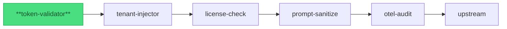

import { Badge, Aside, Code } from '@astrojs/starlight/components';

<Badge text="Stable" variant="success" />

## Purpose

The **token-validator** plugin validates bearer tokens against one or more configured
OIDC/OAuth2 issuers before forwarding a request upstream. Instead of embedding JWT
verification in every service, the gateway validates once and injects identity headers
(`X-Actor-Principal`, `X-Actor-Roles`, `X-Tenant-ID`) so downstream services can trust
the gateway-propagated identity without parsing tokens themselves.

Pipeline position:



*token-validator is pipeline position 1 — the first plugin every request passes through.*

## Config

<Code lang="yaml" title="gateway.yaml (token-validator block)" code={`
token-validator:
  issuers:
    - url: https://auth.example.com/realms/my-realm
      audience: my-service
      jwks_cache_ttl: 300s
      claim_mappings:
        subject: sub
        roles: realm_access.roles
        tenant: tenant_id
    - url: https://accounts.google.com
      audience: my-google-client-id
      jwks_cache_ttl: 600s
      claim_mappings:
        subject: sub
        roles: groups
  algorithms:
    - RS256
    - ES256
  clock_skew_seconds: 10
  required_claims:
    - sub
  propagate_claims:
    mode: all
  on_failure:
    missing_token: 401
    invalid_signature: 401
    expired: 401
    unknown_issuer: 401
    audience_mismatch: 401
    jwks_unavailable: 503
  max_token_bytes: 16384
`} />

| Field | Type | Default | Required | Description |
|---|---|---|---|---|
| `issuers` | list | — | yes (v2 mode) | One entry per trusted OIDC/OAuth2 issuer. |
| `issuers[].url` | string (URL) | — | yes | Issuer URL; must match the `iss` claim in incoming tokens exactly. |
| `issuers[].audience` | string | — | yes | Required `aud` claim value for this issuer. |
| `issuers[].jwks_cache_ttl` | duration | `300s` | no | How long to cache the issuer's JWKS response. |
| `issuers[].claim_mappings.subject` | string | `"sub"` | no | Claim path to extract the actor identity into `X-Actor-Principal`. |
| `issuers[].claim_mappings.roles` | string | — | no | Claim path (dot-notation) for roles → `X-Actor-Roles`. |
| `issuers[].claim_mappings.tenant` | string | — | no | Claim path for tenant ID → `X-Tenant-ID`. Omit to delegate tenant resolution to the tenant-injector plugin. |
| `algorithms` | list | `[RS256, ES256]` | no | Allowed signing algorithms. `none` is always rejected. |
| `clock_skew_seconds` | integer | `0` | no | Tolerance for clock drift on `exp`/`nbf`/`iat`. Max `600`. |
| `required_claims` | list | `[]` | no | Claims that must be non-empty; request fails with 401 if absent. |
| `propagate_claims.mode` | string | `"all"` | no | `all` forwards all validated claims to upstreams; `allowlist` restricts to `propagate_claims.claims`. |
| `propagate_claims.claims` | list | — | no (required when mode=allowlist) | Explicit claim names to propagate. |
| `on_failure.<class>` | integer | see below | no | Override the HTTP status returned for each failure class. |
| `max_token_bytes` | integer | `16384` | no | Reject tokens larger than this (bytes). Guards against oversized-token DoS. |

**Default `on_failure` status codes (v2 mode):**
`missing_token` → 401, `invalid_signature` → 401, `expired` → 401,
`not_yet_valid` → 401, `unknown_issuer` → 401, `audience_mismatch` → 401,
`required_claim_missing` → 401, `disallowed_algorithm` → 401,
`oversized_token` → 400, `jwks_unavailable` → 503.

<Aside type="caution">
  **`claim_mappings.tenant` vs tenant-injector**: If your IDP carries a `tenant_id`
  claim, set `claim_mappings.tenant` here and omit the tenant-injector plugin. If tenant
  resolution requires a webhook lookup (e.g., mapping a user principal to a tenant in an
  external directory), use the tenant-injector plugin instead and leave `claim_mappings.tenant`
  unset. Both at once is safe but redundant — the later plugin's value wins.
</Aside>

## Request/Response

### Reads from request

| Source | Field | How used |
|---|---|---|
| `Authorization` header | `Bearer <token>` | JWT extracted and validated. |
| Token `iss` claim | — | Matched against `issuers[].url` to select the issuer config. |
| Token `aud` claim | — | Verified against `issuers[].audience`. |
| Token `exp`, `nbf`, `iat` | — | Verified with `clock_skew_seconds` tolerance. |

### Writes to request (before forwarding upstream)

| Header | Content | When injected |
|---|---|---|
| `X-Actor-Principal` | Value of `claim_mappings.subject` claim (e.g. `sub`) | Always, when claim present and `claim_mappings.subject` configured. |
| `X-Actor-Roles` | JSON array of roles from `claim_mappings.roles` path | When `claim_mappings.roles` configured and claim present. |
| `X-Tenant-ID` | Value of `claim_mappings.tenant` claim | When `claim_mappings.tenant` configured and claim present. |

Existing `X-Actor-Principal`, `X-Actor-Roles`, and `X-Tenant-ID` headers from the original
request are stripped before forwarding — clients cannot inject their own identity.

### Writes to response

This plugin does not modify responses. It may return an early rejection response; see
Status codes below.

### Status codes the plugin can return early

| Status | Media type | When |
|---|---|---|
| `401` | `application/vnd.yaagents.error+json` | No `Authorization` header; token expired; signature invalid; issuer not in `issuers` list; audience mismatch; required claim absent; disallowed algorithm. Includes `WWW-Authenticate: Bearer realm="yaagents-gateway"` (RFC 7235 §3.1). |
| `400` | `application/vnd.yaagents.error+json` | Token exceeds `max_token_bytes`. |
| `503` | `application/vnd.yaagents.error+json` | JWKS endpoint unreachable or returned a non-2xx response. |

## Security & privacy

### What this plugin trusts

- The JWKS served by each configured `issuers[].url` endpoint (fetched over HTTPS; cached per `jwks_cache_ttl`).
- The `iss` claim in the unverified JWT header — used only to select the issuer config, never to grant access on its own.
- The gateway's own system clock (modulo `clock_skew_seconds`) for `exp`/`nbf`/`iat` checks.

### What this plugin protects

- **Token forgery**: rejects any JWT whose signature cannot be verified against the issuer's JWKS.
- **Issuer confusion**: tokens from an unconfigured issuer are rejected (unknown-issuer path → 401). A token signed by a legitimate-but-unconfigured IDP is not accepted.
- **Header smuggling**: strips `X-Actor-Principal`, `X-Actor-Roles`, and `X-Tenant-ID` from inbound requests before forwarding — clients cannot pre-inject identity headers.
- **Oversized tokens**: `max_token_bytes` guard prevents parse-amplification attacks on the JWT payload.
- **Signing algorithm confusion**: `algorithms` allowlist is enforced before signature verification; `alg: none` is unconditionally rejected regardless of the allowlist.

### PII boundary

JWT claims (including `sub`, role lists, and any tenant ID) are extracted and injected
as request headers — **they are not logged**. The raw token itself is never written to
any log line or span attribute. `claim_mappings` controls exactly which claims reach
`X-Actor-Principal`, `X-Actor-Roles`, and `X-Tenant-ID`; all other claims stay inside
the validated token object and are discarded after the request context is populated.

<Aside type="danger">
  **Do not enable `propagate_claims.mode: all` without reviewing claim content first.**
  `mode: all` forwards every validated claim as a header to upstream services. If the JWT
  carries PII claims (email, phone, full name), those values land in upstream request logs
  verbatim. Prefer `mode: allowlist` in production with an explicit `claims:` list.
</Aside>

### Secrets handling

The plugin receives no secrets at runtime. JWKS keys are fetched from the public
JWKS endpoint of each configured issuer (`issuers[].url/.well-known/jwks.json`) over
HTTPS. No API keys, client credentials, or private keys are loaded from config,
environment variables, or Parameter Store — the issuer URL is the only configuration
sensitive to misconfiguration, not to leakage.

For `test_mode: true` with `jwt_secret` (HS256 local dev), the secret is read from
the `jwt_secret` config key; never commit YAML with a real secret inline.

## Observability

### Spans / events emitted

| Span name | Attributes | When emitted |
|---|---|---|
| `token.validate` | `issuer`, `audience`, `algorithm`, `outcome` (`ok` \| `fail`) | Every request. |
| `jwks.fetch` | `issuer_url`, `status` (`hit` \| `miss` \| `error`) | On JWKS cache lookup; `miss` or `error` only when a network fetch occurs. |

**Bench baseline (BENCH-1; commit 5c657b8; 2026-06-07):** p99 overhead **+4.9 ms** vs
no-plugin baseline at 100 RPS, 2-issuer config with per-issuer JWKS cache TTL 300 s.
Primarily dominated by JWKS cache lookup; warm-cache requests add sub-millisecond overhead.
See [Audit and Observability](/yaagents/architecture/audit-and-observability/)
for the full gateway observability baseline and bench result archive.

### Log lines

```json
{"level":"INFO","msg":"token.validate","issuer":"https://auth.example.com/realms/my-realm","algorithm":"RS256","outcome":"ok","request_id":"req-abc123"}
{"level":"WARN","msg":"jwks.fetch","issuer_url":"https://auth.example.com/...","status":"error","error":"connection refused","request_id":"req-abc124"}
```

WARN-level log on JWKS fetch failure; ERROR-level log on Init failure (startup abort).
No token content, raw claims, or `sub` values appear in log lines.

### Metrics

| Metric | Type | Labels | Description |
|---|---|---|---|
| `yaagents_plugin_token_validate_total` | counter | `issuer`, `outcome` | Cumulative validation count by issuer and outcome. |
| `yaagents_plugin_jwks_fetch_total` | counter | `issuer`, `status` | JWKS fetches by issuer and status (`hit`, `miss`, `error`). |
| `yaagents_plugin_jwks_cache_age_seconds` | histogram | `issuer` | Age of the cached JWKS at validation time (bucket insight for tuning `jwks_cache_ttl`). |

### Correlation-id propagation

Reads `X-Correlation-ID` from the inbound request and attaches it as the
`correlation_id` attribute on the `token.validate` span. Forwards `X-Correlation-ID`
to upstream unchanged (per PRD §9 gateway responsibilities). Does not generate a new
correlation ID — that is the gateway bootstrap layer's responsibility.

## Failure modes

| Failure | Configurable behavior | What the client sees |
|---|---|---|
| No `Authorization` header | `on_failure.missing_token` (default 401) | `401 application/vnd.yaagents.error+json` + `WWW-Authenticate` header. |
| Token signature invalid | `on_failure.invalid_signature` (default 401) | `401 application/vnd.yaagents.error+json` + `WWW-Authenticate`. |
| Token expired | `on_failure.expired` (default 401) | `401 application/vnd.yaagents.error+json`. |
| `iss` not in `issuers` list | `on_failure.unknown_issuer` (default 401) | `401 application/vnd.yaagents.error+json`. |
| `aud` mismatch | `on_failure.audience_mismatch` (default 401) | `401 application/vnd.yaagents.error+json`. |
| Required claim absent | `on_failure.required_claim_missing` (default 401) | `401 application/vnd.yaagents.error+json`. |
| Disallowed algorithm (incl. `none`) | `on_failure.disallowed_algorithm` (default 401) | `401 application/vnd.yaagents.error+json`. |
| Token exceeds `max_token_bytes` | Fixed 400 (not overridable) | `400 application/vnd.yaagents.error+json`. |
| JWKS endpoint unreachable | `on_failure.jwks_unavailable` (default 503) | `503 application/vnd.yaagents.error+json`. Requests fail closed — no pass-through mode. |

<Aside type="tip">
  Every failure mode in this table has a corresponding e2e test in
  `gateway/internal/plugins/tokenvalidator/tokenvalidator_e2e_test.go`.
  Per integration-test discipline,
  these tests fail loud when infrastructure is unreachable — they are never silently skipped.
</Aside>
