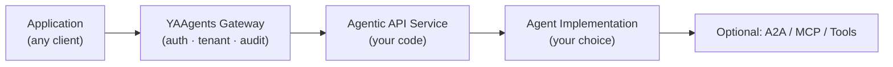

import { Card, CardGrid, Aside, Code, Steps, LinkCard } from '@astrojs/starlight/components';

## What YAAgents is

YAAgents is a **gateway, SDK layer, and response contract** for exposing agentic capabilities as governed domain resource operations. You keep whatever agent framework you want — LangGraph, Pydantic AI, Semantic Kernel, a direct LLM call, or custom logic. YAAgents governs the application-to-agent boundary: auth, tenant context, audit, typed responses, and OpenAPI contracts.

<Code lang="http" title="YAAgents pattern vs generic invoke" code={`POST /campaigns/{id}/optimizations    ← YAAgents pattern
POST /tickets/{id}:triage             ← YAAgents pattern
POST /agents/invoke                   ← what YAAgents replaces`} />

<Aside type="note">
  YAAgents is not an agent framework. It is the REST and gateway layer around
  whatever agent framework you choose. Your agent implementation lives behind the
  boundary — YAAgents governs what crosses it.
</Aside>

## Where it fits

*YAAgents governs the application-to-agent boundary. Agent frameworks, A2A, AGNTCY, and MCP can operate behind that boundary.*

<Steps>
1. **Application layer** — any HTTP client (Python, TypeScript, Go, curl). Sends typed requests to resource-oriented endpoints. Receives typed, structured responses — no free-form text parsing.

2. **YAAgents Gateway** — Go process fronting every agentic API. Handles JWT authentication, tenant context injection, license verification, prompt sanitization, and audit logging via composable plugins.

3. **Agentic API Service** — your service code, using the sdk-fastapi (Python) or sdk-go (Go) server SDK. Implements resource-oriented handlers; returns typed `AgenticResponse` outcomes.

4. **Agent Implementation** — whatever reasoning pipeline fits your domain. LangGraph, LangChain, Semantic Kernel, Pydantic AI, direct LLM SDK calls, or custom logic. YAAgents has no opinion here.

5. **Optional ecosystem** — A2A, AGNTCY, MCP tool servers, vector stores, or any other agent-to-agent or agent-to-tool protocol. These operate behind the yaagents boundary, invisible to the client.
</Steps>

## What you get

<CardGrid>
  <Card title="Add agents behind existing product APIs">
    Keep your domain endpoints. Expose AI optimization, recommendation, or classification as new resource operations — no separate "agent server" surface.
  </Card>
  <Card title="Govern many agent services in one place">
    Centralize auth, tenancy, audit, and license enforcement in the gateway. Your agent services stay simple; the gateway handles the policy layer.
  </Card>
  <Card title="Keep OpenAPI and SDK discipline">
    Typed response outcomes, OpenAPI-first contracts, generated native clients. No free-form text parsing; no ad-hoc JSON shapes.
  </Card>
  <Card title="Wrap any agent framework">
    LangGraph, Pydantic AI, Semantic Kernel, or custom logic — yaagents is the governed boundary, not the reasoning engine. Swap frameworks without changing your API contract.
  </Card>
</CardGrid>

## What it is not

- **Not an agent framework** — yaagents does not provide a reasoning pipeline, a memory layer, or an LLM abstraction.
- **Not a chatbot framework** — yaagents is for resource-oriented domain APIs, not conversational UIs.
- **Not an A2A replacement** — A2A is a peer-to-peer agent communication protocol; yaagents is the governed REST boundary between your application and your agent services. They work at different layers.
- **Not an AGNTCY replacement** — AGNTCY is an agent-directory and discovery protocol; yaagents is the serving layer.
- **Not an MCP replacement** — MCP is a tool-server protocol for LLM tool use; yaagents is the application-facing API boundary. Both can coexist in the same stack.
- **Not a model provider abstraction** — yaagents does not choose your LLM, manage model fallbacks, or abstract provider SDKs.
- **Not a routing or load-balancer** — the gateway routes to a configured upstream; multi-upstream routing is out of scope.

<Aside type="tip">
  Comparing yaagents to A2A, AGNTCY, MCP, or LangGraph in detail? See the
  [comparison page](/yaagents/concepts/comparisons/) — each entry is a neutral layer
  characterization, not a dismissal.
</Aside>

## Where to go next

<CardGrid>
  <LinkCard title="Try it in 10 minutes" href="/yaagents/quickstart/" description="Run the e-commerce recommendations demo end-to-end." />
  <LinkCard title="Plugin overview" href="/yaagents/plugins/" description="All five first-party gateway plugins: auth, tenancy, license, sanitization, audit." />
  <LinkCard title="Read the Profile" href="https://github.com/ai-mpathyminds/yaagents/blob/main/spec/agentic-rest-profile.md" description="The Agentic REST Response Profile v0.3 — the normative response contract." />
</CardGrid>
