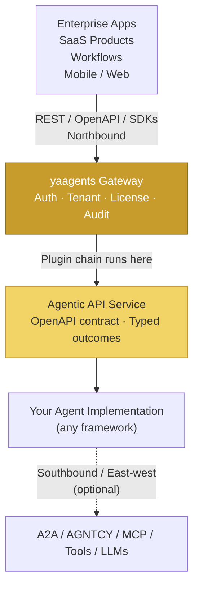

import { Badge } from '@astrojs/starlight/components';

# Where yaagents fits <Badge text="Stable" variant="success" />

The AI tooling landscape has several distinct layers. yaagents governs **one layer**:
the boundary between an enterprise application and the agentic capabilities it exposes
as REST APIs.

---

## Architecture

---

## Layer responsibilities

| Layer | Technology | Responsibility |
|-------|-----------|----------------|
| **Northbound** (callers) | REST / OpenAPI / Client SDKs | Make typed HTTP calls; parse typed outcomes |
| **yaagents Gateway** | Go binary; plugin pipeline | Auth, tenancy, license, audit — once for every service |
| **Agentic API Service** | FastAPI / Go HTTP / any framework | OpenAPI contract, typed `AgenticResponse` factory |
| **Agent implementation** | LangGraph / CrewAI / Anthropic SDK / custom | Domain logic; calls LLMs and tools |
| **Southbound / East-west** | A2A, AGNTCY, MCP, tool APIs | Agent-to-agent calls; tool/context retrieval |

---

## Northbound, southbound, east-west

- **Northbound**: enterprise application → yaagents gateway → agentic service.
  This is the boundary yaagents governs — the REST call that crosses an organizational
  or tenancy boundary.

- **Southbound**: your agent implementation → LLMs, databases, third-party APIs.
  yaagents has no opinion here; bring any model or tool.

- **East-west**: agent → agent coordination (A2A / AGNTCY) or agent → context/tool (MCP).
  These happen *inside* your agent implementation. yaagents is not involved.

---

## How yaagents relates to the other layers

| Protocol / Tool | Governs | Relationship to yaagents |
|----------------|---------|--------------------------|
| **A2A / AGNTCY** | Agent ↔ Agent | East-west behind the yaagents boundary — complementary |
| **MCP** | Agent ↔ Tool/Context | Southbound behind the yaagents boundary — complementary |
| **LangGraph / CrewAI / SK** | Agent logic construction | Inside your agent implementation — complementary |
| **Anthropic SDK / OpenAI SDK** | Model access | Southbound — complementary |
| **yaagents** | Application ↔ Agentic capability | The northbound REST governance layer |

> **One-liner:** A2A / AGNTCY = agent ↔ agent; MCP = agent ↔ tool/context;
> LangGraph/LangChain/CrewAI/SK = build agent logic;
> **yaagents = application ↔ agentic capability**.

---

## A concrete example — order fulfillment

Imagine an e-commerce platform that fulfills orders using several AI capabilities:

1. **Application** sends `POST /orders/{id}/fulfillment-plans` with the order details
   (northbound, governed by yaagents).
2. **yaagents gateway** validates the bearer token, injects `X-Tenant-ID`, checks the
   license quota for this tenant, and proxies to the fulfillment-planner service.
3. **Fulfillment-planner service** calls its agent logic:
   - Uses MCP to retrieve warehouse stock context (southbound)
   - Spawns a routing sub-agent via A2A to find the cheapest carrier (east-west)
4. **Agent implementation** returns a typed response — `AgenticResponse.created(plan)`
   or `AgenticResponse.clarification_required(...)` if stock is insufficient.
5. **Application** handles the typed outcome — render the plan or prompt the user for
   clarification. No free-form JSON parsing required.

The gateway handles auth/tenant/audit once. The application parses typed outcomes.
The agent implementation is free to use any internal orchestration.

---

[Read next → Reference Architecture →](/yaagents/architecture/reference-architecture/)
